## Use case 01: Digital Twin Builder for Contoso Energy: Contextualizing Data and Visualizing Insights

**Introduction**

This use case guides users through the process of building a digital
twin model using Microsoft Fabric’s Real-Time Intelligence capabilities.
Participants will learn how to set up a Microsoft Fabric workspace,
create and manage lakehouses, ingest and transform both contextual and
streaming data, model real-world entities using Digital Twin Builder,
and visualize insights using Kusto Query Language (KQL) and Real-Time
Dashboards. The lab simulates a transportation scenario using bus
movement and location data, demonstrating how real-time analytics can be
contextualized for operational insights.

**Scenario**

The sample scenario used in this tutorial is a set of bus data,
containing information about bus movements and locations. By using
digital twin builder (preview) to contextualize and model the data, you
can analyze and estimate bus behavior.

This analysis includes estimating whether a bus will be late at the next
stop, while also using borough-level location data to analyze delay
patterns. The analysis can be used to estimate delays at individual
stops and identify geographic trends, like which stops and boroughs
experience more frequent delays.

**Objectives**

- To introduce users to Microsoft Fabric’s Digital Twin Builder
  (preview) within Real-Time Intelligence.

- To demonstrate how to integrate static and streaming datasets using
  Lakehouse and Eventhouse.

- To model a real-world scenario (bus and stop data) through ontology
  creation in Digital Twin Builder.

- To use KQL for querying processed data and extract actionable
  insights.

- To visualize time-series and entity data in a Real-Time Dashboard.

- To learn best practices for entity mapping, relationship definition,
  and data transformation.

## Exercise 1: Create a Microsoft Fabric workspace

### Task 1: Sign in to Power BI account 

1.  Open your browser, navigate to the address bar, and type or paste
    the following URL: +++https://app.fabric.microsoft.com/+++ then
    press the Enter button.

> 

2.  In the Microsoft Fabric window, enter assigned credentials, and
    click on the Submit button.

> 

3.  Then, In the Microsoft window enter the password and click on
    the Sign in button.

> 

4.  In Stay signed in? window, click on the Yes button.

> 

5.  You’ll be directed to Fabric Home page.

> 

### Task 2: Create a workspace

Before working with data in Fabric, create a workspace with the Fabric
trial enabled.

1.  In the Workspaces pane Select **+** **New Workspace**. 

> 

2.  In the **Create a workspace tab**, enter the following details and
    click on the **Apply** button.

  |   |   |
  |----|----|
  |Name	|+++Digital twin builderXX+++ (XX can be a unique number)|
  |Advanced	|Under License mode, select Fabric capacity|
  |Default	|storage format Small dataset storage format|


  > 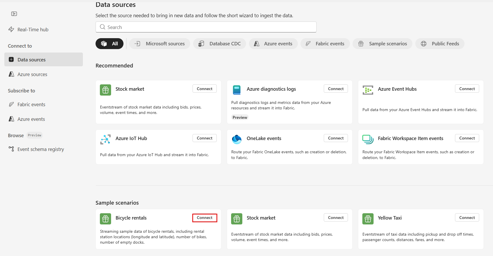
  >
  > 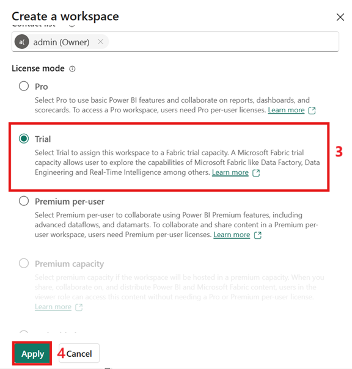

3.  Wait for the deployment to complete. It takes 1-2 minutes to
    complete. When your new workspace opens, it should be empty.

  > 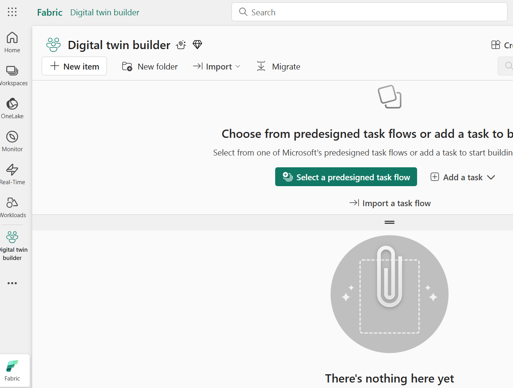

### **Task-1: Enable Digital twin builder for your tenant**

1.  Go to **settings** option in Fabric and select **Admin portal**.

> 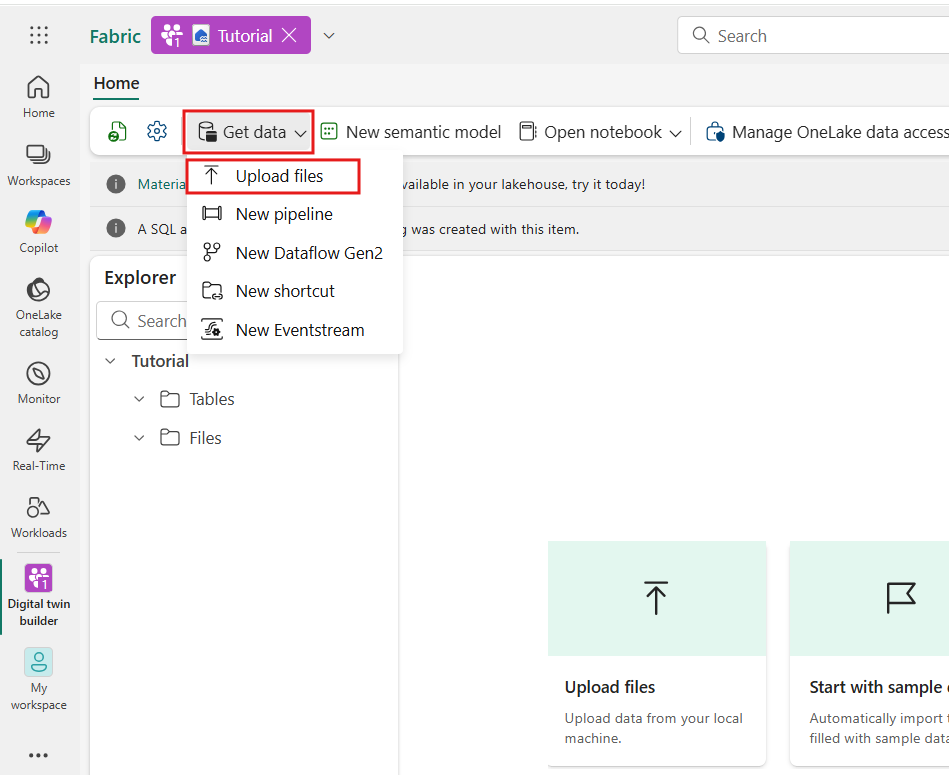

2.  Enable the **Digital Twin Builder (preview)** switch and click on
    **Apply**. 

> 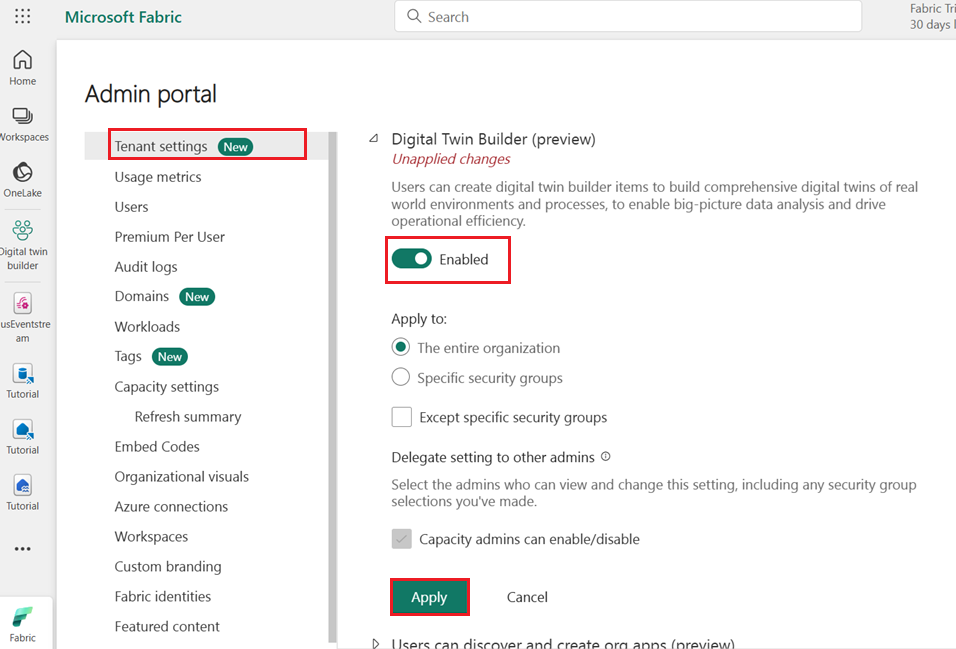
>
> 

## Exercise 2: Upload contextual data

### Task 1: Create a lakehouse

1.  In the Workspaces pane, select **+ New item**.

> 

2.  In the **Filter by item type** search box, enter +++**Lakehouse+++**
    and select the lakehouse item.
  
  > 

3.  Enter **+++Tutorial+++** as the lakehouse name and
    select **Create**. When provisioning is complete, the lakehouse
    explorer page is shown.

  
  
  

### Task 2: Upload static contextual data

1.  In the lakehouse explorer page in Fabric, select **Get data** from
    the menu ribbon and choose **Upload files**.

    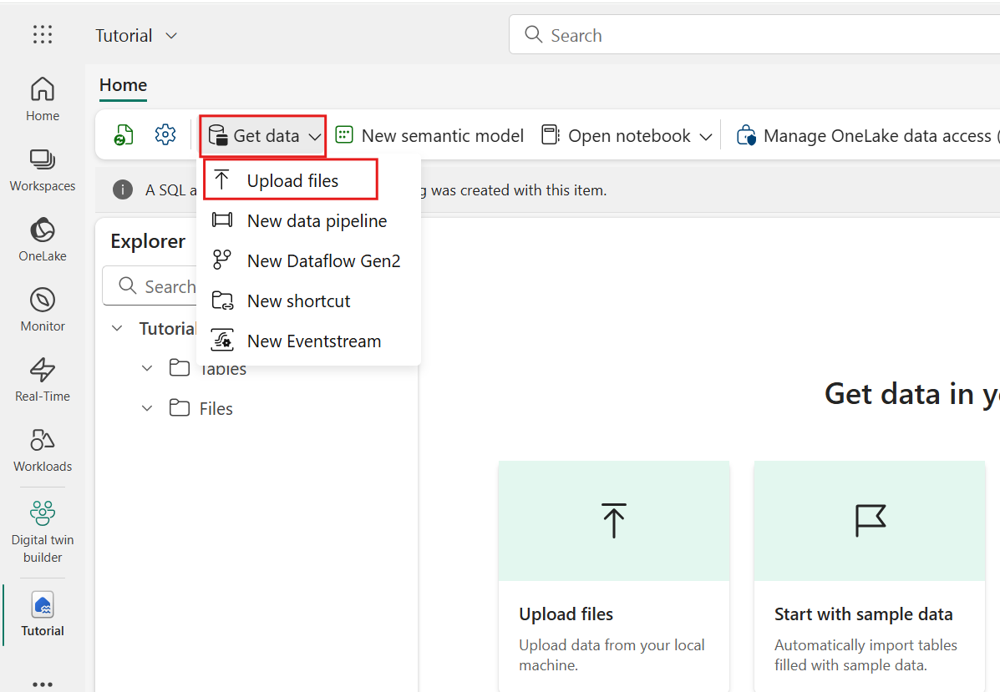

2.  On the Upload files tab, click on the folder under the Files

    

3.  Browse to **C:\LabFiles** on your VM, then
    select ***stops_data.csv*** file and click on **Open** button.

    

3.  Now select **Upload**. When the file is finished uploading, close
    the **Upload files** pane.

    
    
    

4.  lick and select refresh on the **Files**. The file appear.

    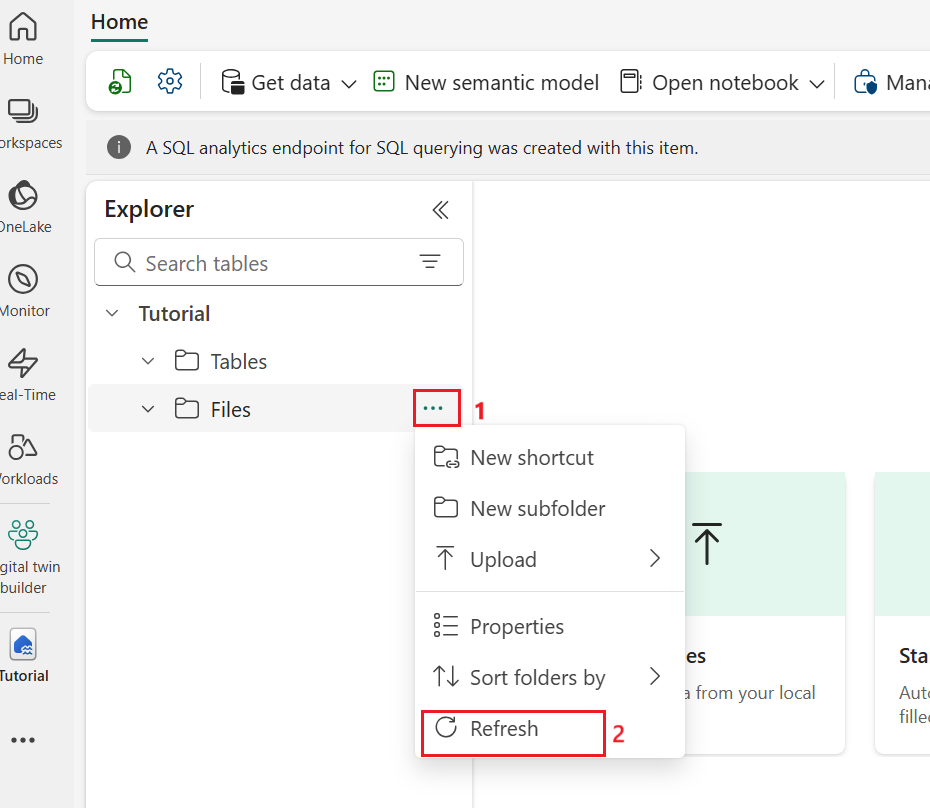

5.  In the **Explorer** pane on the left, select **Files**. Hover over
    the file name and select the **...** that appears. Then
    select **Load to Tables** and **New table**.

    
    
    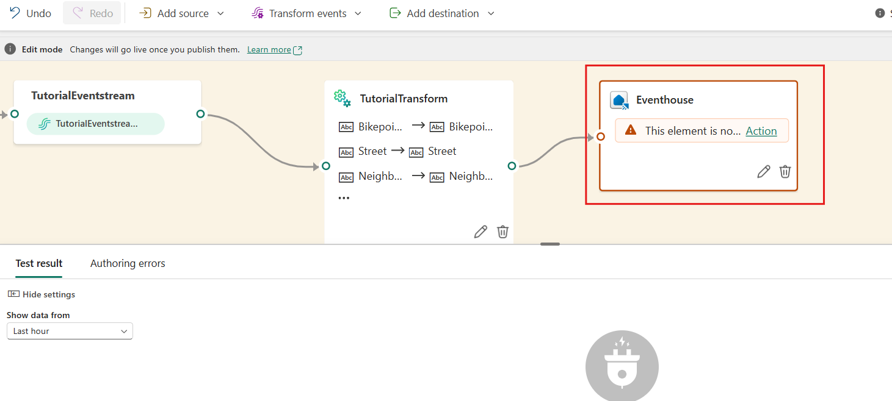
    
    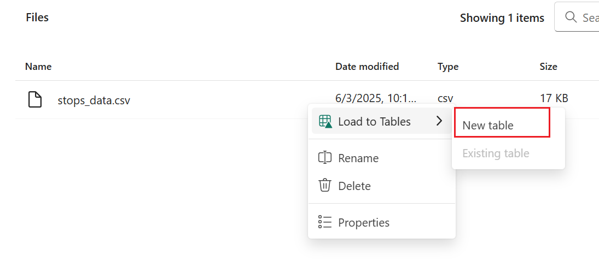

6.  Name the table **+++stops_data+++**. Leave the other default
    settings and select **Load**.

    > 
    >
    > 
    >
    > 

7.  When the table is created, review your new **stops_data** table and
    verify that it contains data.

    

## Exercise 3: Get and process streaming data

In this part of the exercise, you set up another type of sample data: a
real-time data stream of sample bus data that includes time series
information about bus locations. You stream the sample data into an
eventhouse, perform some transformations on the data, then create a
shortcut to get the eventhouse data into the sample data lakehouse that
you created in the previous section. Digital twin builder requires data
to be in a lakehouse.

### Task 1: Create an eventhouse

1.  From the **Tutorial**  page, select **Digital twin builder** in the
    left-sided navigation menu to return to the workspace item list.

> 

2.  In the Workspaces pane, select **+ New item**.

  > 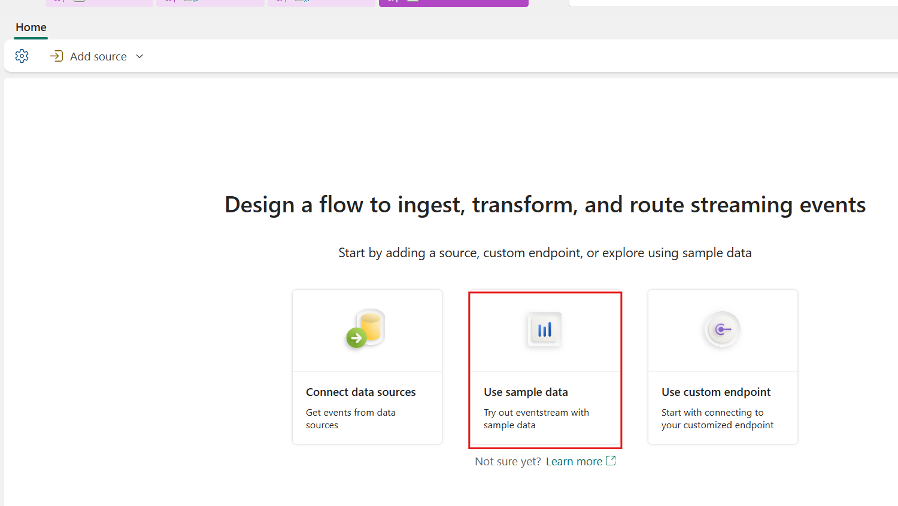

3.  In the **Filter by item type** search box,
    enter +++**Eventhouse+++** and select the Eventhouse item.

  > 

4.  Enter +++**Tutorial+++** as the eventhouse name. A KQL database is
    created simultaneously with the same name and select **Create**. 

  > 

5.  When provisioning is complete, the eventhouse **System
    overview** page is shown.

  > 

### Task 2: Add Data Source to Event Stream

In this task, you will create an Event Stream and add the Buses sample
data as the source.

1.  From the **KQL databases** pane in the eventhouse, select the
    new **Tutorial** database.
    
    

2.  From the menu ribbon, select **Get data** and choose **Eventstream
    \> New eventstream**.

    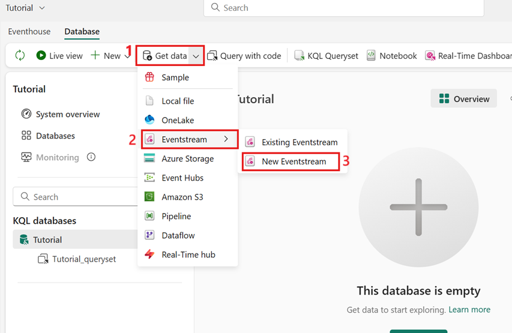

3.  Name your eventstream +++**BusEventstream***+++*. When the
    eventstream is finished creating, it opens.

  > 

4.  Select **Use sample data**.

> 

5.  In the **Add source** page, enter +++**BusDataSource**+++ for the
    source name. Under **Sample data**, select ***Buses***.
    Select **Add**.

    

6.  When the new eventstream is ready, it opens in the authoring canvas.

    

### Task 3: Transform data

In this task, you add one transformation to the incoming sample data.
This step casts the string fields ScheduleTime and Timestamp to DateTime
type, and renames Timestamp to ArrivalTime for clarity. Timestamp fields
need to be in DateTime format for digital twin builder (preview) to use
them as time series data.

Follow these steps to add the data transformation.

1.  Select the down arrow on the **Transform events or add
    destination** tile, then select the **Manage fields** predefined
    operation. The tile is renamed to **ManageFields**.

    
    
    

2.  Select the edit icon (shaped like a pencil) on
    the **MangeFields** tile, which opens the **Manage fields** pane.

    

3.  Select **Add all fields**. This action ensures that all fields from
    the source data are present through the transformation.

    

4.  Select the **Timestamp** field. Toggle **Change type** to *Yes*.
    For **Converted Type**, select **DateTime** from the dropdown list.
    For **Name**, enter the new name of +++**ActualTime+++.** Without
    saving, select the **ScheduleTime** field.

    
    
    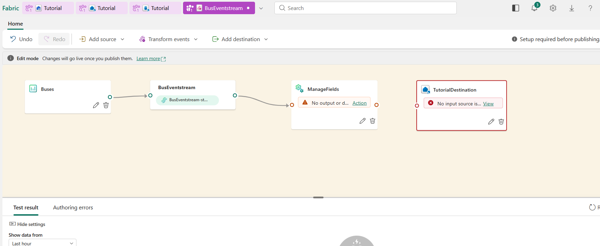

    Toggle **Change type** to *Yes*. For **Converted Type**,
    select DateTime from the dropdown list. Leave the name as ScheduleTime
    and select **Save**.

    

5.  The **Manage fields** pane closes. The **ManageFields** tile
    continues to display an error until you connect it to a destination.

    

### Task 4: Add destination

1.  From the menu ribbon, select **Add destination**, then
    select **Eventhouse**.

    

2.  Enter the following information in the **Eventhouse** pane:

    |Field	|Value|
    |-----|---|
    |Data ingestion mode	|Event processing before ingestion|
    |Destination name	|+++TutorialDestination+++|
    |Workspace|	Select the workspace in which you created your resources.|
    |Eventhouse|	Tutorial|
    |KQL Database|	Tutorial|
    |KQL Destination table|	Create new - Enter +++bus_data_raw+++ as the table name|
    |Input data format|	Json|


      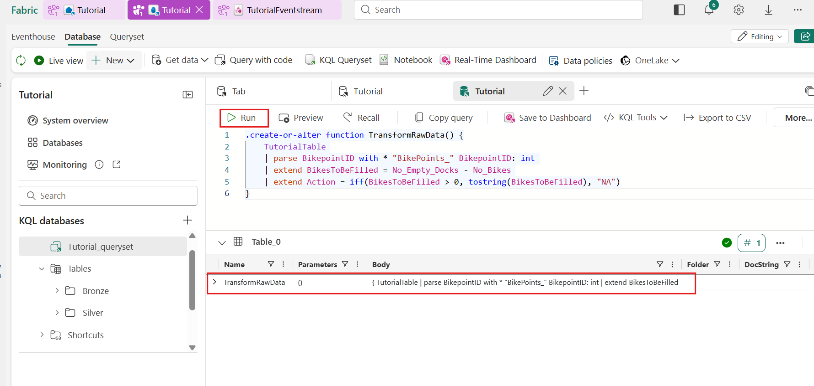
      
      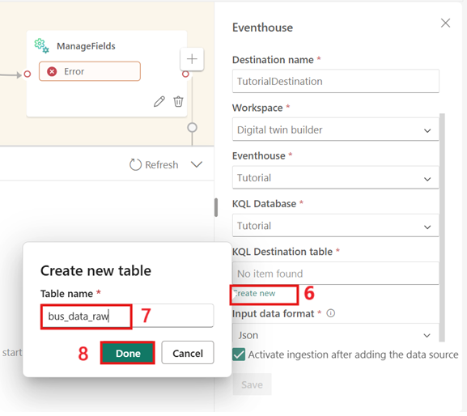

3.  Ensure that the box **Activate ingestion after adding the data
    source** is checked.

4.  Select **Save**.

    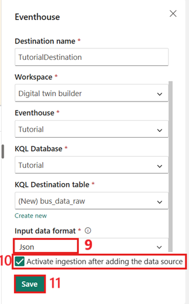
    
    

5.  In the authoring canvas, select the **ManageFields** tile and drag
    the arrow to the **TutorialDestination** tile to connect them. This
    action resolves all error messages in the flow.

      

6.  From the menu ribbon, select **Publish**. The eventstream now begins
    sending the sample streaming data to your eventhouse.

    > 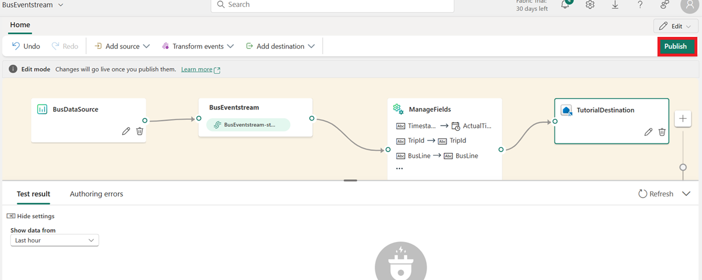
    >
    > 

7.  After a few minutes, the **TutorialDestination** card in the
    eventstream view displays sample data in the **Data preview** tab.
    You might need to refresh the preview a few times while you wait for
    the data to arrive.

    

8.  Verify that the data table is active in your eventhouse. Go to
    your **Tutorial KQL** database and refresh the view. It now contains
    a table called **bus_data_raw** which contains data.

    
    
    

### Task 5:Transform the data using update policies

Now that your bus streaming data is in a KQL database, you can use
functions and a [Kusto update
policy](https://learn.microsoft.com/en-us/kusto/management/update-policy) to
further transform the data. The transformations that you perform in this
section prepare the data for use in digital twin builder (preview), and
include the following actions:

- Break apart the JSON field Properties into separate columns for each
  of its contained data items, BusStatus and TimeToNextStation. Digital
  twin builder doesn't have JSON parsing capabilities, so you need to
  separate these values before the data goes to digital twin builder.

- Add column StopCode, which is a unique key representing each bus stop.
  The purpose of this step is just to complete the sample data set to
  support this tutorial scenario. Joinable entities from separate data
  sources must contain a common column that digital twin builder can use
  to link them together, so this step adds a simulated set of int values
  that matches the Stop_Code field in the static bus stops data set. In
  the real world, related data sets already contain some kind of
  commonality.

- Create a new table called *bus_data_processed* that contains the
  transformed bus data.

- Enable OneLake availability for the new table, so that you can use a
  shortcut to access the data in your *Tutorial* lakehouse.

To run the transformation queries, follow these steps.

1.  Select the **Tutorial** KQL database inside your eventhouse. From
    the menu ribbon, select **Query with code**, which opens the KQL
    query editor.

    
    
    

2.  Copy and paste the following code into the query editor. Run each
    code block in order.
    ```
    // Set columns
    .create-or-alter function extractBusData ()
    {
        bus_data_raw
        | extend BusState = tostring(todynamic(Properties).BusState)
            , TimeToNextStation = tostring(todynamic(Properties).TimeToNextStation)
            , StopCode = toint(10000 + abs(((toint(BusLine) * 100) + toint(StationNumber)) % 750))
        | project-away Properties
    }
    ```
    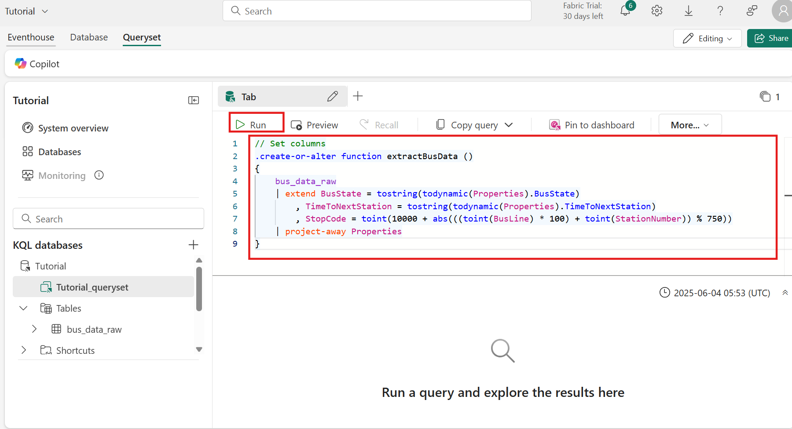
    
    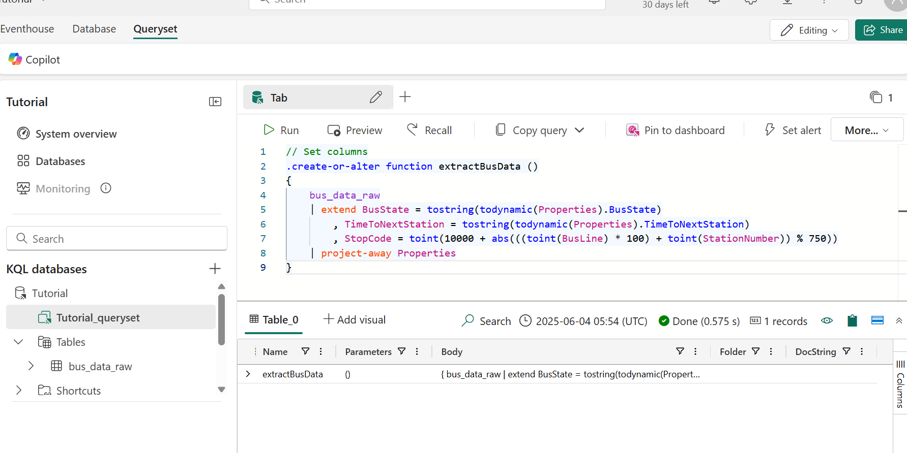

3.  Select the cell, replace the code, and click the **Run** icon
    ```
    // Create table
    .create table bus_data_processed (ActualTime:datetime, TripId:string, BusLine:string, StationNumber:string, ScheduleTime:datetime, BusState:string, TimeToNextStation:string, StopCode:int)
    ```  
    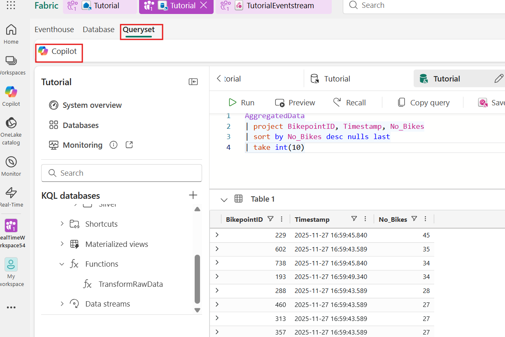

4.  Select the cell, replace the code, and click the **Run** icon
    KustoCopy.
    ```
      //Load data into table
      .alter table bus_data_processed policy update
      ```
      [{
          "IsEnabled": true,
          "Source": "bus_data_raw",
          "Query": "extractBusData",
          "IsTransactional": false,
          "PropagateIngestionProperties": true
      }]
      ```
    ```
    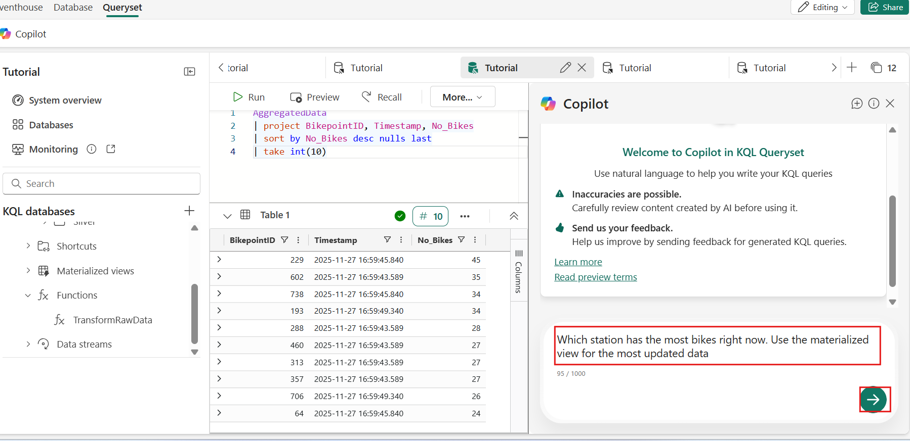

5.  Select the cell, replace the code, and click the **Run** icon
    ```
    // Enable OneLake availability
    .alter-merge table bus_data_processed policy mirroring dataformat=parquet with (IsEnabled=true, TargetLatencyInMinutes=5)
    ```


    

  **Tip:** You can also enable OneLake availability for the new table
  through the UI instead of using code. Select the table and toggle
  on **OneLake availability**.

    

  With the UI option, the default latency is 15 minutes to several hours,
  depending on the volume of data. To reduce the latency to five minutes,
  use the [**.alter-merge
  table**](https://learn.microsoft.com/en-us/fabric/real-time-intelligence/event-house-onelake-availability#adaptive-behavior) command
  as shown in the previous code block.

6. Go the items view of the database again, select **Tutorial** .

  > 

7.  A new table is created in your database
    called **bus_data_processed**. After a short wait, it begins to
    populate with the processed bus data.

    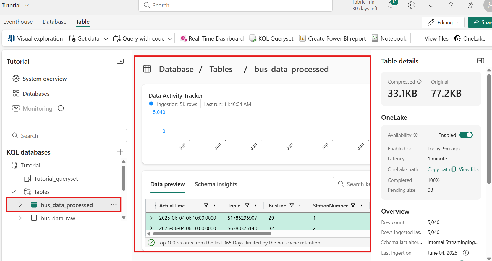

### Task 6: Create lakehouse shortcut

Finally, create a shortcut that exposes the processed bus data in
the *Tutorial* lakehouse, which holds sample data for digital twin
builder (preview). This step is necessary because digital twin builder
requires its data source to be a lakehouse.

1.  Go to your **Tutorial** lakehouse from the menu ribbon.
    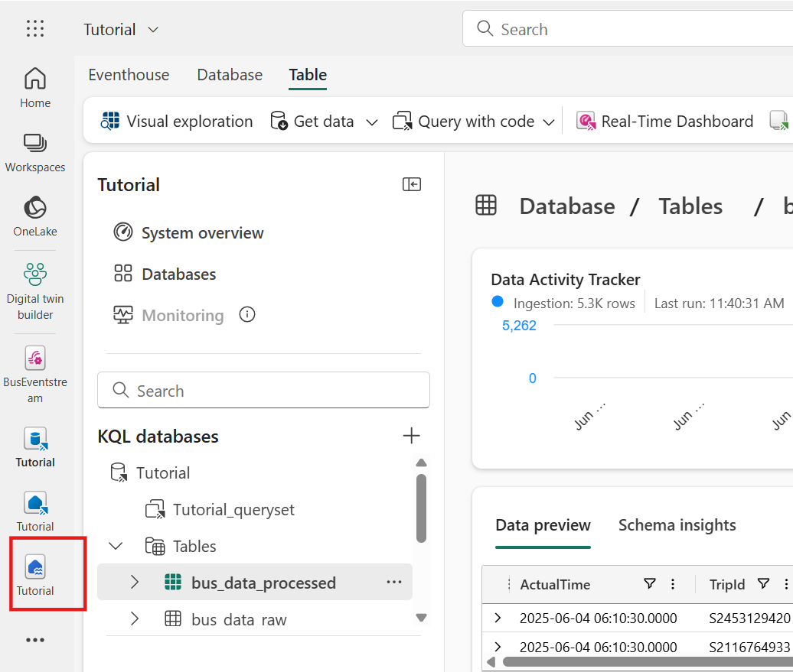

2.  Dropdown the **Get data** and select **New shortcut** from the top
    navigation menu.

    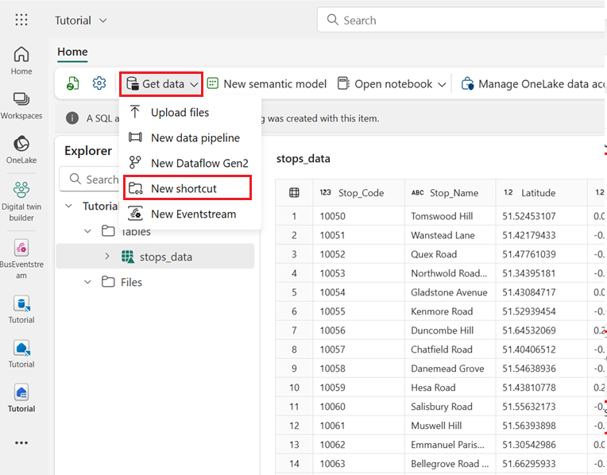

3.  Under **Internal sources**, select **Microsoft OneLake**. Then,
    choose the **Tutorial KQL** database and click on the **Next**
    button

    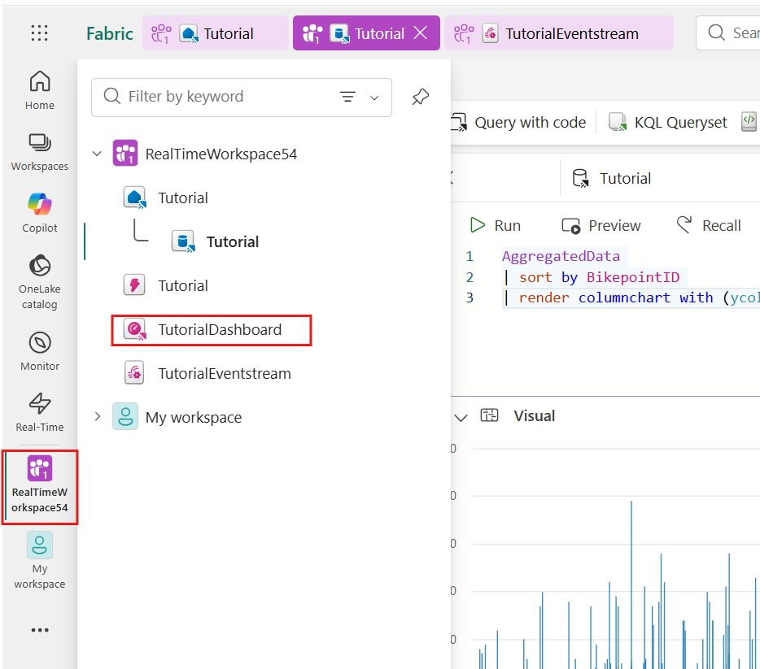
    
    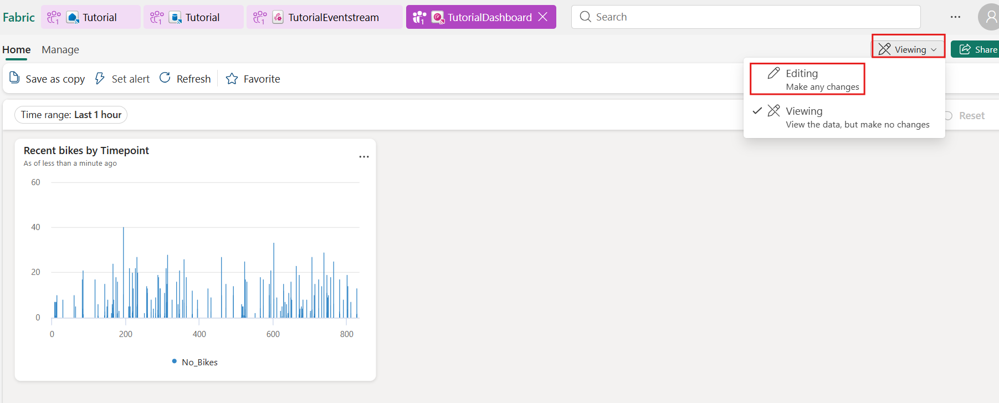

4.  Expand the list of **Tables** and check the box next
    to **bus_data_processed**. Select **Next**.

    

5.  Review your shortcut details and select **Create**.

    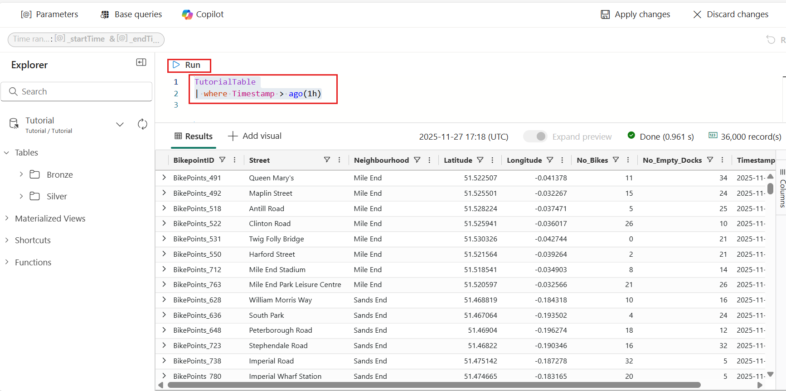

6.  The **bus_data_processed** table is now available in your lakehouse.
    Verify that it contains data (this might take a few minutes).

   

  Next, you use this lakehouse data as a source to build an ontology in
  digital twin builder.

## Exercise 4: Build the ontology

In this part of the exercise, you build a digital twin ontology that
models the bus and bus stop data. You create a digital twin builder
(preview) item, and define entities for the buses and stops. Then, you
map the data from the *Tutorial* lakehouse to the entities, and define
relationships between the entities to further contextualize the data.

### ** Task 1: Create new digital twin builder item in Fabric**

1.  Now, click on **Digital twin builder** on the left-sided navigation
    pane.
    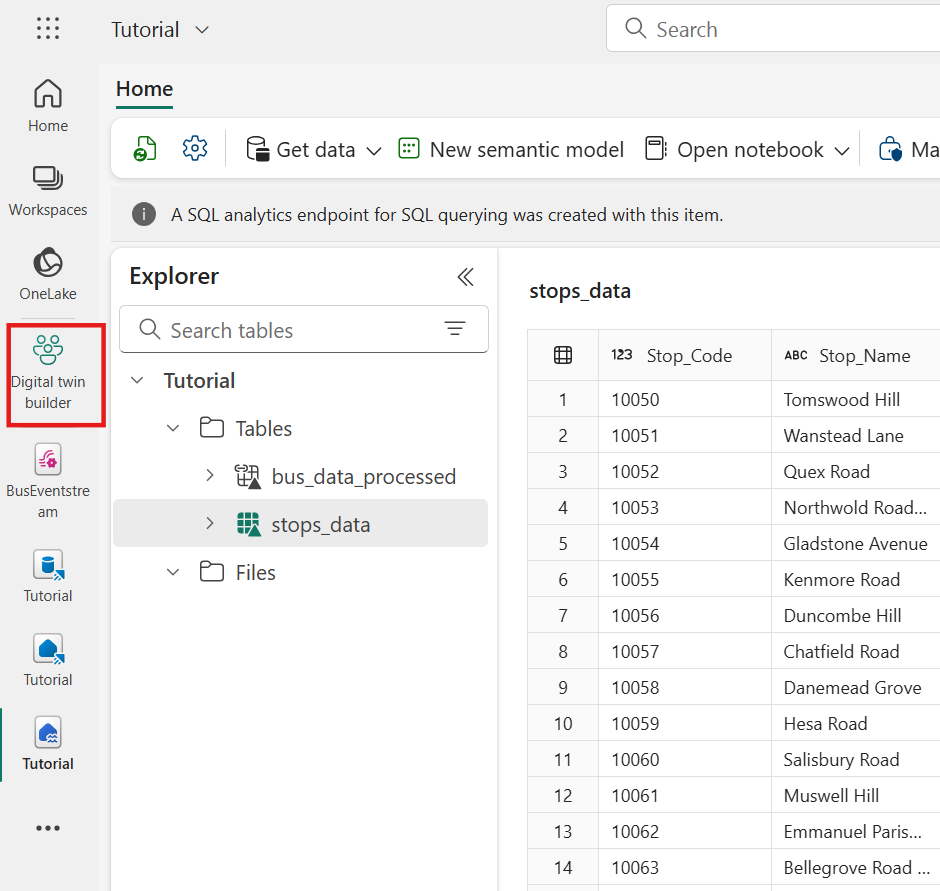

3.  Select **New item**.Search for the **+++Digital Twin Builder(preview)+++** item, and select it.

     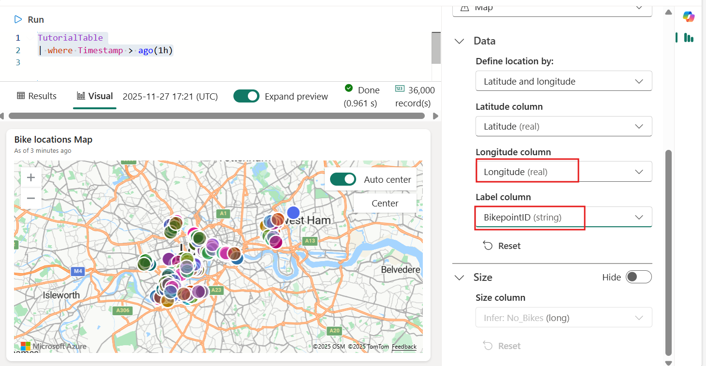

3.  Enter +++**BusModel+++ **as the name for your item and
    select **Create**.

     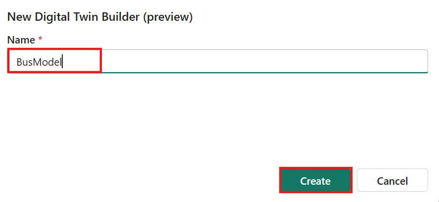

4.  Wait for your digital twin builder item to be created. Once your
    digital twin builder item is ready, it opens to the semantic canvas.

  > 

In the semantic canvas, you can add entities and relationships to define
an ontology.

### About entities and relationships

In digital twin builder (preview), an *entity* is a category that
defines a concept within a domain-specific ontology. The entity
definition serves as a blueprint for individual entity instances of that
entity, and specifies common characteristics shared across all instances
within that category. Here you define two entities for the sample
scenario: Bus and Stop.

After you create an entity, you can map data to it to hydrate the entity
with data from various source systems. You can add both time series and
non-time series properties to an entity. When mapping both types of
property to an entity, you must map at least one non-time series
property before you can map time series properties. Then, link the
non-time series and time series data together by matching a non-time
series property from the entity with a column from the time series data.
The values in the time series column must **exactly** match data that's
mapped to the entity property.

After your entities are defined and mapped, you can
create *relationships* between them to define how they're related to
each other. In this tutorial, a Bus *goesTo* a Stop.

### Task 2: Add Bus entity

First, create a new entity for the bus.

1.  In the semantic canvas of digital twin builder (preview),
    select **Add entity**.

  > 

2.  Leave the Generic system type selected, and enter +++**Bus+++** for
    the entity name. Select **Add entity**.

> 

3.  The **Bus **entity is created and becomes visible on the canvas.

> 

### Task 3: Map non-timeseries bus data

Next, map some non-timeseries data to the Bus entity. These fields are
static properties that identify a bus and its visit to a certain stop.

1.  In the **Entity configuration** pane, switch to the **Mappings** tab
    and select **Add data**.

   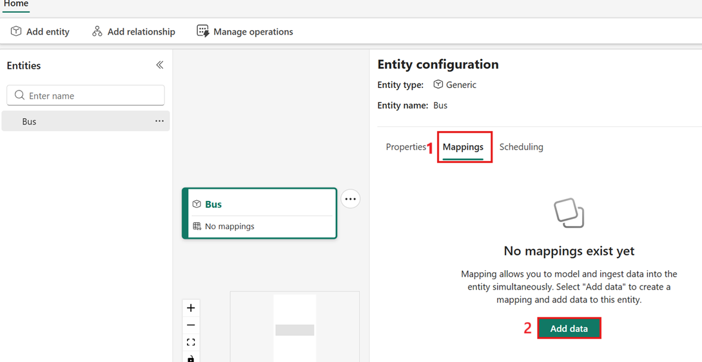

2.  Open **Select lakehouse table** to select a data source for your
    mapping.

    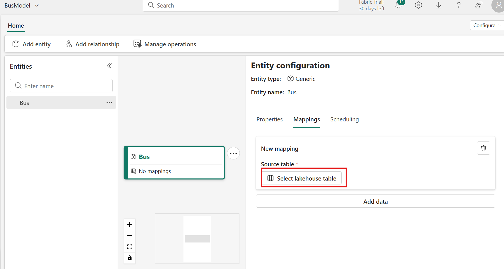

3.  Select your tutorial workspace, the **Tutorial** lakehouse, and the
    **bus_data_processed** table.Optionally, wait for the data preview
    to load. Select **Choose data source** to confirm.

   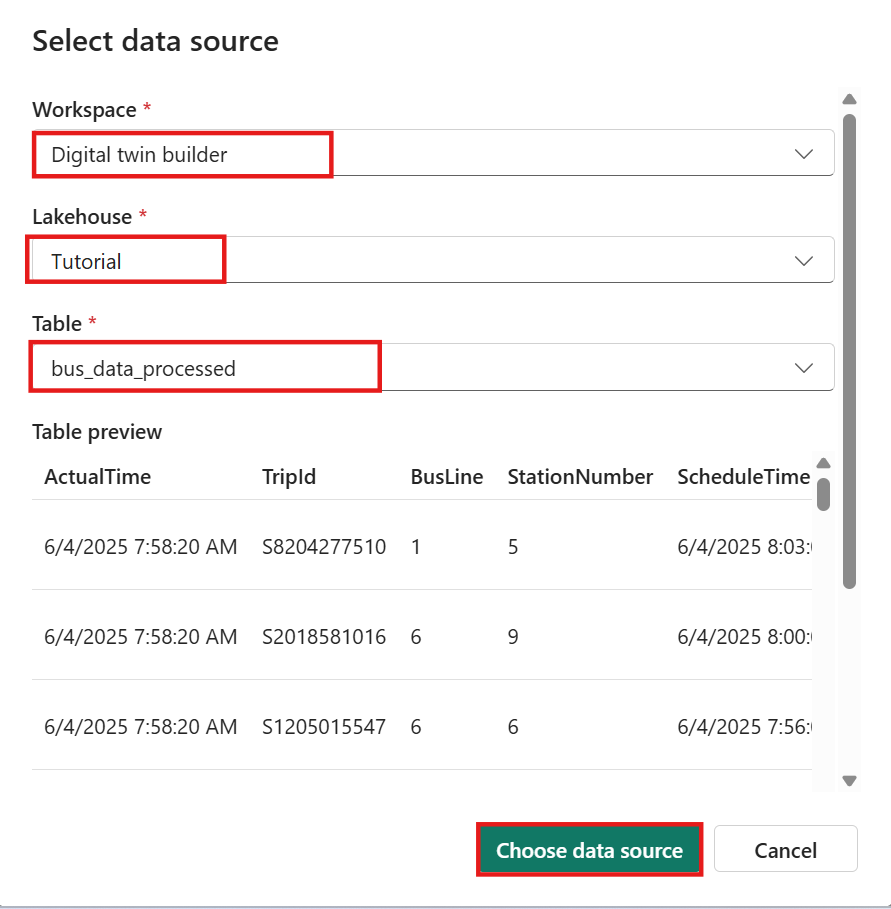

4.  For the **Property type**, leave the default selection
    of **Non-timeseries properties**.

   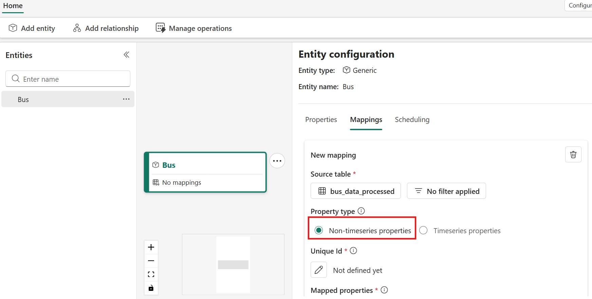

5.  Under **Unique Id**, select the **edit icon** (shaped like a pencil)
    to choose a unique ID out of one or more columns from your source
    data. Digital twin builder uses this field to uniquely identify each
    row of ingested data. Select **TripId **as the unique ID column.

    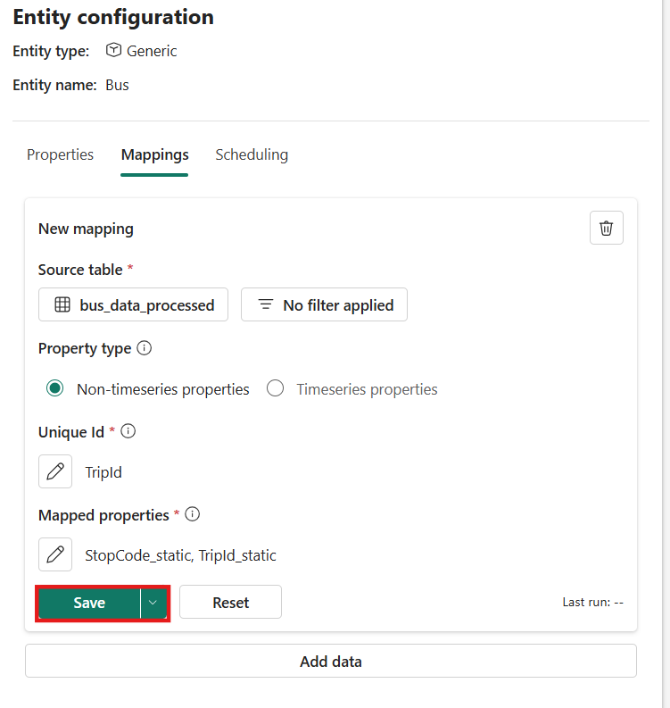
 
    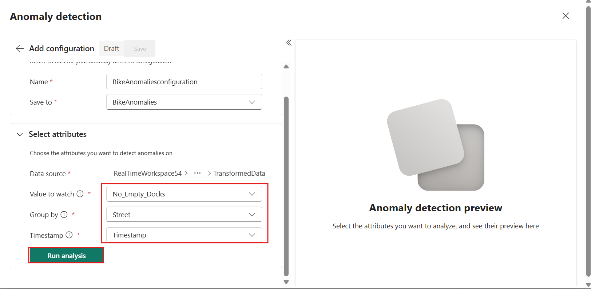
 
    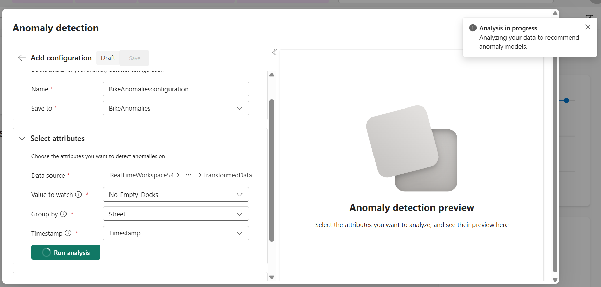

6.  Under **Mapped properties**, select the **edit icon** to choose
    which properties from your source data to map to the bus entity.

     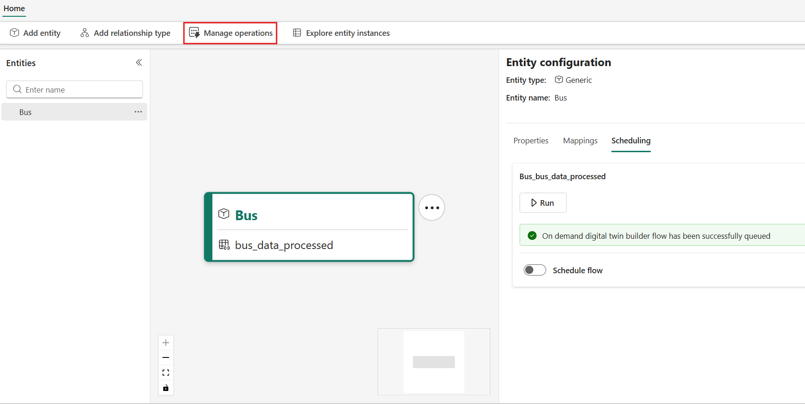
 
    > The **Map properties** page lets you select a column from your source
    > data on the left side, and map it to a new property on your entity on
    > the right side. By default, selecting a column name from the source
    > data on the left side fills in the right side automatically with a
    > matching name for the entity property, but you can enter a new name
    > for the property on the right side if you want the entity property to
    > be named something different than what it's called in the source data.

11. The page loads with a DisplayName property for the entity, which is
    unmapped to any column in the source data. Leave
    the *DisplayName* property unmapped as it is, and select **Add
    entity property** to add new properties to the mapping.

  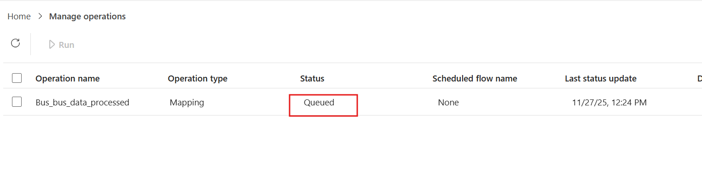

  Map the following entity properties:

  - Select **TripId** from the dropdown menu in the left column, and edit
    the box across from it in the right column to read **TripId_static**.
    This action creates a property on the bus entity
    named +++**TripId_static**+++, which gets its value from
    the **TripId** property in the source data.

  &nbsp;

  - Select **StopCode** from the dropdown menu in the left column, and
    edit the box across from it in the right column to
    read **StopCode_static**. This action creates a property on the bus
    entity named **StopCode_static**, which gets its value from
    the **StopCode** property in the source data.
  
  - Check the box to acknowledge that properties can't be renamed or
    removed, and select **Apply**.

      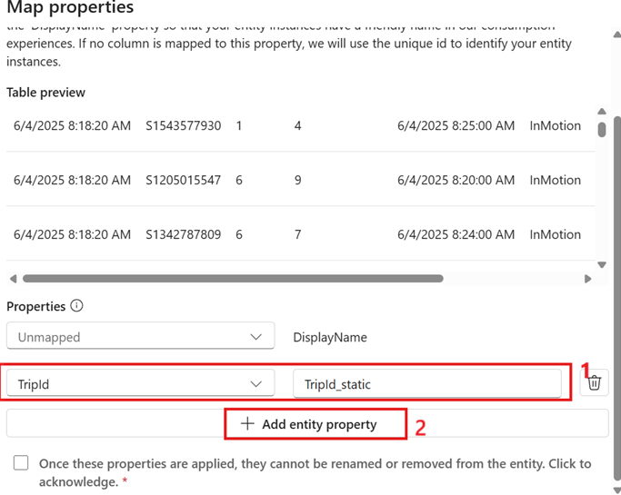
    
    

7.  Select **Save** the mapping.

   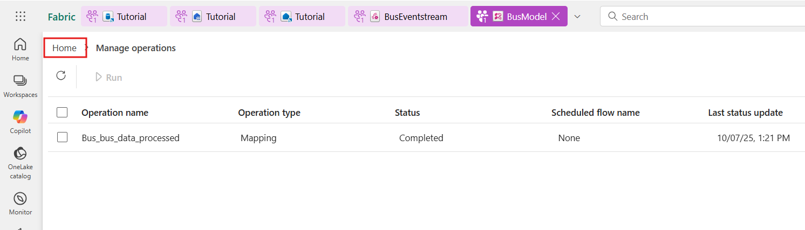

8.  Switch to the **Scheduling** tab and select **Run now** to apply the
    mapping.

   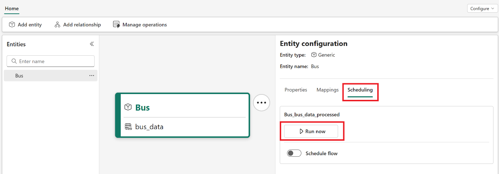

9. The page confirms that the flow is queued.

    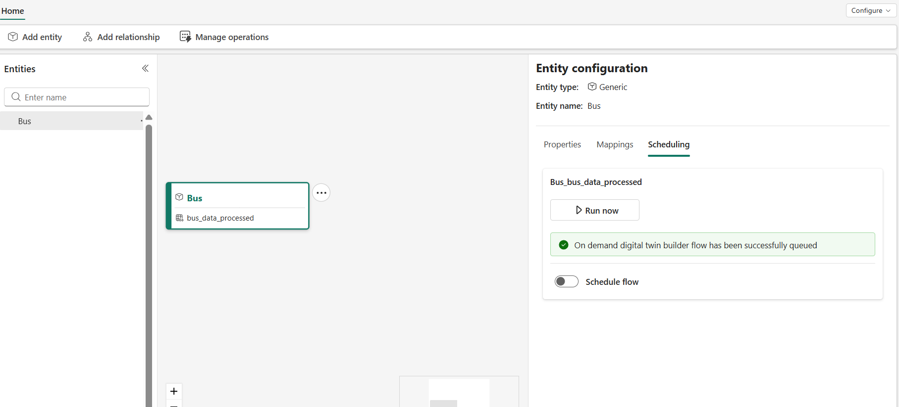

9.  Check the status of your mapping job in the **Manage
    operations** tab. Wait for the status to say **Completed** before
    proceeding to the next section (the operation might take several
    minutes to begin running from the queue, and several more minutes to
    complete once it starts, so you might need to refresh the content a
    few times).

  > 
  >
  > 
  >
  > 

11. Select the **Configure**

  > 

### Task 4: Map time series bus data

Next, map some time series data to the Bus entity. These properties are
streamed into the data source from the Eventstream sample data, and they
contain information about the bus's location and movements.

1.  Go back to the **Configure** view and reselect the **Bus** entity.
    In the **Entity configuration** pane, reopen the **Mappings** tab.
    Select **Add data** to add a new mapping.

    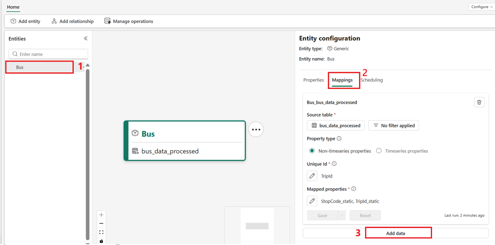

2.  Select  **Select lakehouse table** to select a data source for your
    mapping.
     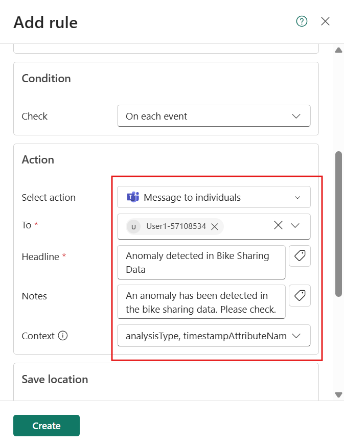

3.  In the Select data source tab , select **Digital twin builder**
    workspace, the **Tutorial** lakehouse, and
    the **bus_data_processed** table. Select **Choose data source**.

     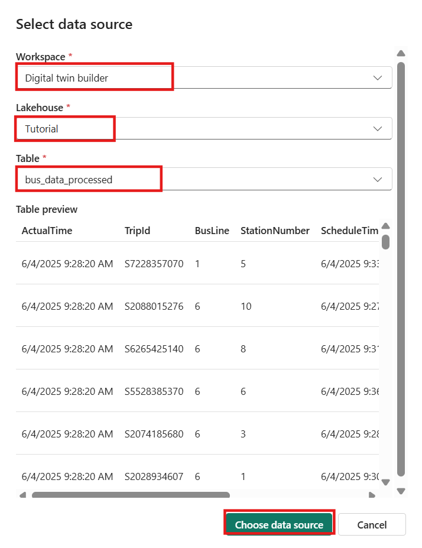

4.  This time, switch the **Property type** to **Timeseries
    properties**.

  > 

5.  Under **Mapped Properties**, select the **edit icon**.

  > 

6.  The page loads with a **Timestamp **property for the entity, which
    is unmapped to any column in the source data. **Timestamp** requires
    a mapping, so select **ActualTime** from the corresponding dropdown
    menu on the left side. Then, select **Add entity property** to add
    new properties to the mapping.

    

7.  Map the following properties. When you select these property names
    from the source columns on the left side, leave the default matching
    names that populate on the right side.

    - **ScheduleTime**

    &nbsp;

    - **BusLine**

    &nbsp;

    - **StationNumber**

    &nbsp;

    - **StopCode**

    &nbsp;

    - **BusState**

    &nbsp;

    - **TimeToNextStation**

    &nbsp;

    - **TripId**

8.  Check the box to acknowledge that properties can't be renamed or
    removed, and select **Apply**.

  > 

9.  Next, link your time series data to this entity. This process
    requires you to select an entity property and a matching column from
    your time series data table. The column selected from the time
    series data must **exactly** match data that is mapped to the
    selected entity property. This process ensures correct
    contextualization of your entity and time series data.

10. Under **Link with entity property**, select the **edit** icon.

    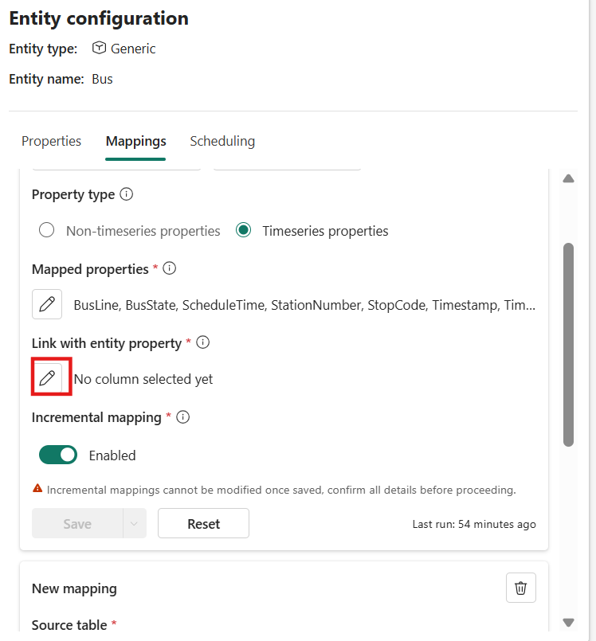

11. For **Choose entity property,** select **TripId_Static** from the
    dropdown menu. For **Select column from timeseries data...**,
    select **TripId**. Select **Apply**.

    > 

12. Make sure **Incremental mapping** is **enabled** and **Save** the
    mapping. Confirm when prompted.

   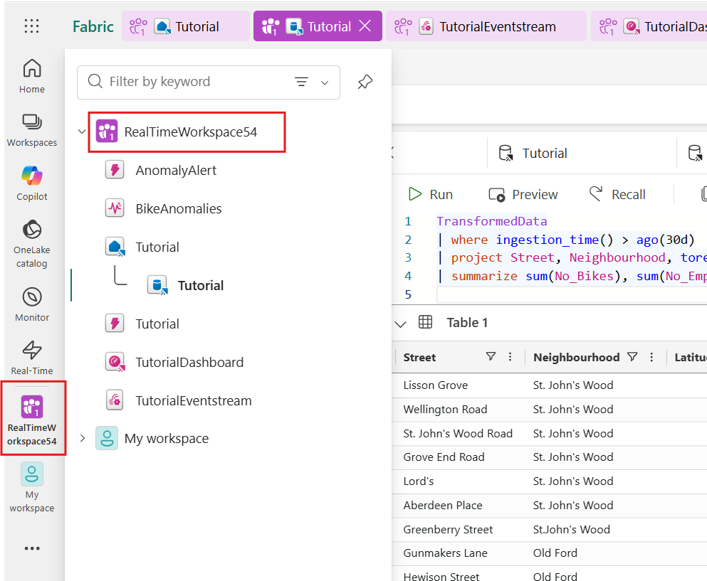
 
   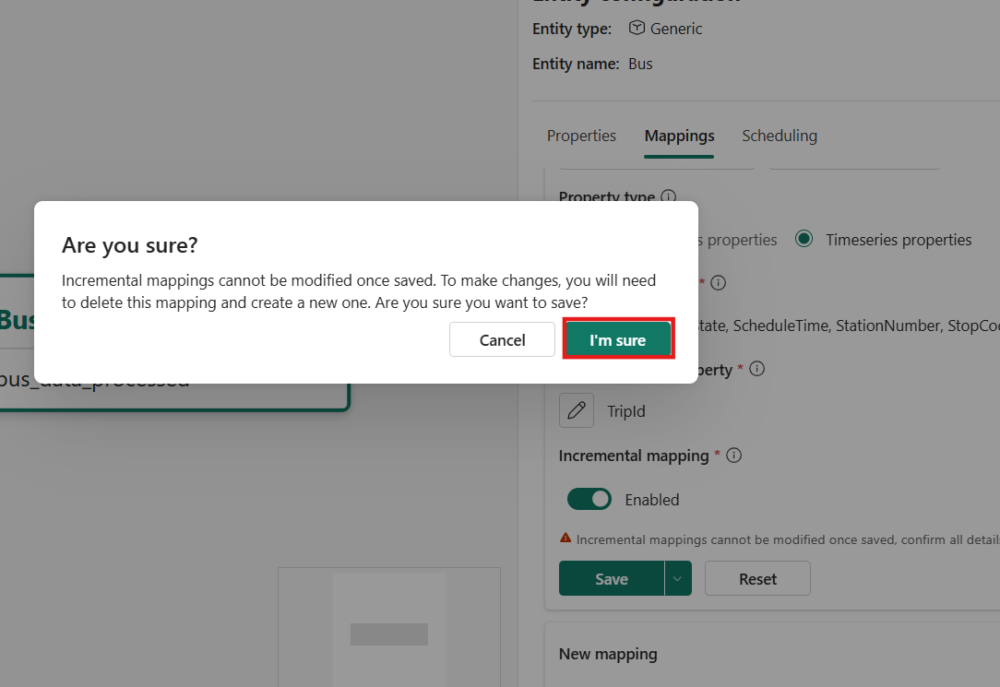
  
   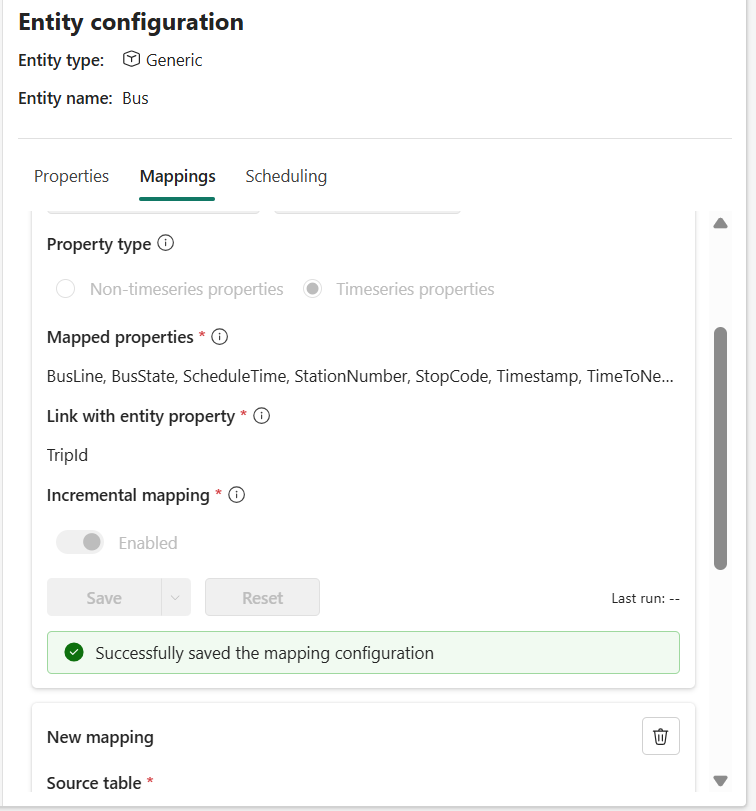

13. Switch to the **Scheduling** tab and select **Run now** under the
    new time series mapping to apply it.

     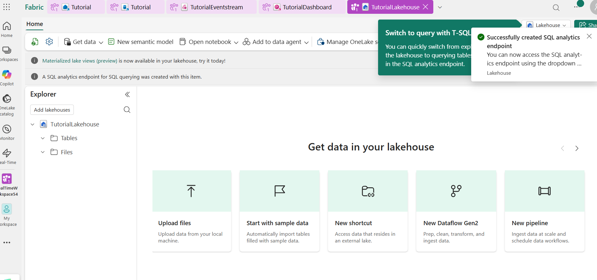
    
     

14. Check the status of your mapping job in the **Manage
    operations** tab. Wait for the status to say **Completed** before
    proceeding to the next task. It will take around 10-15 min to
    complete.

   
  
   

15.  Select the **Configure**

    

### Task 5: Add Stop entity

Next, create a second entity to represent a bus stop.

1.  In the semantic canvas, select **Add entity**.

    

2.  Leave the **Generic** system type selected, and
    enter +++**Stop+++** for the entity name. Select **Add entity**.

    

3.  After a few minutes, the **Stop **entity is now visible on the
    canvas.

    

### Task 6: Map non-timeseries stop data

Next, map some non-timeseries data to the Stop entity. The stop data
doesn't contain any time series data, only static data about the bus
stops and their locations. Later, when you link the Stop and Bus
entities together, this data is used to enrich the bus fact data with
dimensional data.

1.  In the **Entity configuration** pane, open the **Mappings** tab and
    select **Add data**.

   

2.  Open **Select lakehouse table** to select a data source for your
    mapping

    

3.  In the Select data source tab, select your tutorial workspace,
    the **Tutorial lakehouse**, and
    the **stops_data** table.Select **Choose data source**.

  

4.  For the **Property type**, leave the default selection
    of **Non-timeseries properties**.

   

3.  For the **Unique Id**, select **Stop_Code**.

    
   
    

4.  For **Mapped properties**, map **Stop_Name** from the source data to
    the DisplayName property on the right side.

    

5.  Then, add the following new properties to the mapping. When you
    select these property names from the source columns on the left
    side, leave the default matching names that populate on the right
    side.

    - **Stop_Code**
    
    &nbsp;
    
    - **Road_Name**
    
    &nbsp;
    
    - **Borough**
    
    &nbsp;
    
    - **Borough_ID**
    
    &nbsp;
    
    - **Suggested_Locality**
    
    &nbsp;
    
    - **Locality_ID**
    
    &nbsp;
    
    - **Latitude**
    
    &nbsp;
    
    - **Longitude**

    Check the box to acknowledge that properties can't be renamed or
    removed, and select **Apply**.
 
   

5.  **Save** the mapping.

     

6.  Switch to the **Scheduling** tab and select **Run now** to apply the
    mapping.

  

7. Check the status of your mapping job in the **Manage
    operations** tab. Wait for the status to say **Completed** before
    proceeding to the next task. It will take around 10-15 min to
    complete.

   

8.  Click on **Refresh**

   
 
   
 
   

9.  Select the **Configure**

   

### Task 7:Define relationship

Next, create a relationship to represent that a Bus **goesTo** a Stop.

1.  In the semantic canvas, highlight the **Bus** entity and
    select **Add relationship**.

    

2.  In the **Relationship configuration** pane, enter the following
    information and Select **Create**.

  - **First entity**: Bus
  
    - **Property to join**: StopCode_static
  
  &nbsp;
  
  - **Second entity**: Stop
  
    - **Property to join**: Stop_Code
  
  &nbsp;
  
  - **Relationship name**: Enter +++**goesTo***+++*
  
  &nbsp;
  
  - **Select relationship type**: Many Stop per Bus (1:N)

    

2.  In the **Scheduling** section that appears, select **Run now** to
    apply the relationship.

   

3.  Now your Bus and Stop entities are visible in the canvas with a
    relationship between them. Together, these elements form the
    ontology for the usecase scenario.

   

### Task 8: Verify mapping completion

As a final step, confirm that all your data mappings ran successfully.
Each mapping might take several minutes to run.

1.  From the menu ribbon, select **Manage operations**.

    

2.  Select the **Refresh** button

   

3. Wait for the status to say **Completed** before proceeding to the
    next task. It will take around 10-15 min to complete.

   

4.  View the details of the mapping operations, and confirm that they
    all completed successfully.

    

5.  If any of the operations failed, check the box next to its name and
    select **Run now** to rerun it.

Wait for all mappings to complete before you move on to the next part of
the tutorial. In the next part, you project the ontology that you mapped
to an eventhouse, to support further data analysis and visualization.

## Exercise 5: Project data to Eventhouse

### Task 1: Prepare eventhouse KQL database

Start by preparing your eventhouse and KQL database to access digital
twin builder (preview) data.

Data from digital twin builder mappings is stored in a new lakehouse,
with a name that looks like your digital twin builder item name followed
by *dtdm*. For this tutorial, it's called *BusModeldtdm*. The lakehouse
is located in the root folder of your workspace.

In this task, you add tables from your digital twin builder data
lakehouse as external tables in the KQL database. Later, you run sample
notebook code to set up an Eventhouse projection that runs on and
organizes this data.

1.  Now, click on **Tutorial **KQL database on the left-sided navigation
    pane

   

2.  From the menu ribbon, select **New** \> **OneLake shortcut**.

    

3.  Under **Internal sources**, select **Microsoft OneLake**. Then,
    choose **BusModeldtdm**.

   
 
   

4.  Expand the list of **Tables** and begin selecting all tables.
    There's a limit to the number of tables that you can add to a
    shortcut at once, so stop after you **select 10 tables** and see the
    warning message. Make a note of where you stopped.

5.  Select **Next** 

    

6.  Select **Create** to create the shortcuts.

    

7.  If you see a dialog box – **Shortcut creation completed**, then
    click on **Close**

    

8.  Repeat the shortcut creation steps twice more, so that all tables
    are added as shortcuts.

  
 
  
 
  
 
  
 
  
 
  

   
   
  
   
   
  
   
  
   

8.  When you're finished, you see all the external digital twin builder
    data tables under **Shortcuts** in the KQL database.

    

   

### Task 2: Prepare notebook and install dependencies

Next, prepare a notebook to run the sample Eventhouse projection code on
the digital twin builder data in the KQL database. In this step, you
import the sample notebook and link it to your digital twin builder
data, then upload and install the required Python package.

**Import the notebook**

First, import the sample Fabric notebook. It contains code to generate
the Eventhouse projection.

1.  Now, click on **Digital twin builder** workspace on the left-sided
    navigation pane

    

2.  In the workspace, from the menu ribbon,
    select **Import** \> **Notebook** \> **From this computer**.

    

3.  Select **Upload** from the navigate to **Import** section.
    

4.  Navigate and select **DTB_Generate_Eventhouse_Projection** notebook
    from **C:\LabFiles** and click on the **Open** button.

     

5.  You will see a notification stating **Imported successfully.**

    

6.  Select **DTB_Generate_Eventhouse_Projection** notebook from the
    workspace

     

7.  From the **Explorer** pane of the notebook, select **Add data
    items** and select **Existing data sources**.

    

8.  Select the ***BusModeldtdm*** lakehouse and select **Connect**.

    
 
    

9.  In the **Explorer** pane, select **...** next to the lakehouse name,
    and select **Set as default lakehouse**. 

    

Optionally, remove the other lakehouse that was added by default to
simplify the view.

### Task 3: Upload and install the Python package

Next, install the Python package that the notebook needs to work with
digital twin builder data. In this section, you upload the package to
your lakehouse and install it in the notebook.

1.  In the **Explorer** pane of open notebook,
    expand ***BusModeldtdm*.** Select **...** next to **Files**, and
    select **Upload** \> **Upload files**.

    

2. On the Upload files tab, click on the folder under the Files

   

3.  Browse to C:\LabFiles on your VM, then select
    dtb_samples-0.1-py3-none-any.whl file and click on Open button.

    

4. Click on **Upload**

   

5. Close the **Upload files** pane and observe the new file in
    the **Files** pane for the lakehouse.

    
   
    

6. In the notebook, install the package by running the first code
    block.

   

7.  After less than a minute, the package is installed and the notebook
    confirms the successful run status with a checkmark underneath the
    code.

  

### Task 4: Run Eventhouse projection code

Next, run the rest of the notebook code to generate the Eventhouse
projection script. This script creates user-defined functions in
Eventhouse that correspond to your digital twin builder entities and
their properties.

1.  In the second code block, there are variables
    for **dtb_item**_name and **kql_db_name**. Fill their values
    with **BusModel** and ***Tutorial* **(case-sensitive). Run the
    code block. The notebook confirms the successful run status with a
    checkmark underneath the code.

     

    

2.  Scroll down to the next code block and run it. This code block
    completes the following operations:

    1.  Connects to your **workspace** and your **digital twin builder
        ontology**

    2.  Sets up a **Spark reader** to pull data from the digital twin
        builder database

    3.  **Generates a script** that pushes your digital twin builder
        data into Eventhouse

    4.  Automatically creates several **functions** based on your
        digital twin builder's configuration, to make this data readily
        accessible in Eventhouse for use in KQL queries

   3.  The notebook confirms the successful run status with a checkmark
       underneath the code, and a list of functions that were added (one
       for each entity and property type).
      

    Note: If you see a **ModuleNotFoundError**, rerun the first code block
    with the package installation. Then, rerun this code block.

4.  **Run** the last code block. This code runs a **Python** snippet
    that sends your script to the Fabric REST API and executes it
    against KQL database.

5.  The notebook confirms the successful run status with a checkmark
    underneath the code, and confirmation that it successfully created
    the Eventhouse domain projection functions.

    

Now the projection functions are created in Eventhouse, one for each
digital twin builder entity and its property types.

### Task 5:Verify projection functions

Verify that the functions were created successfully in your KQL
database.

1.  Go to **Tutorial KQL** database and refresh the view.

   

2.  Expand **Functions** in the Explorer pane to see a list of functions
    created by the notebook

   

3.  Select **Tutorial_queryset** from the Explorer pane to open the
    query window and use the **+** above the query pane to create a new
    query.
    

5.  Enter **+++show functions+++** and run the cell.

    

5.  In the output, a list of functions within the queryset is displayed.
    Expand the **extractBusData** function to view its detailed
    implementation and associated information
    

    

6.  Run the functions to see the data projections they produce.
    Recognize that the properties correspond to the fields that you
    mapped to the digital twin builder ontology

7.  Select the cell, replace the code with +++Bus_property()+++, and
    click the **Run** icon
    

9.  Rename the tab as **+++xplore functions+++**

    
    
    

Now write other KQL queries using these user-defined functions to access
data from digital twin builder (preview) ontology. In the next tutorial
section, you use these functions to write KQL queries that extract
insights from your data, and display the results in a Real-Time
Dashboard.

## Exercise 6: Query and visualize data

### Task 1: Query the data using KQL

1.  Using the **+** above the query pane, create the following new
    queries.
    

3.  This query calculates the delay of each bus trip, by comparing the
    current time and the time to the next station with the scheduled
    arrival time.

4.  In the query editor, copy and paste the following code. Click on
    the **Run** button to execute the query. After the query is
    executed, you will see the results. 
    ```
    //Start with the function generated by the eventhouse projection to get your time series bus data
    Bus_timeseries()
    // Parse your travel time string into a timespan
    | extend TimeToNextStationSpan = totimespan(TimeToNextStation)      
    // Compute when the bus will actually arrive
    | extend PredictedArrival = PreciseTimestamp + TimeToNextStationSpan  
    // Compare that prediction to the schedule
    | extend Delay = PredictedArrival - ScheduleTime
    | extend DelayRounded        = format_timespan(Delay, 'hh:mm:ss')
    // Flag and label a delay of more than 5 minutes
    | extend IsDelayed = Delay > 5m  
    | extend DelayLabel = iff(IsDelayed, "Delayed", "On Time")              
    // Select final output columns
    | project
        TripId,
        BusLine,
        StopCode,
        DelayLabel,
        DelayRounded,
        PreciseTimestamp,
        TimeToNextStationSpan,
        PredictedArrival,
        ScheduledArrival = ScheduleTime
    ```
    
   
    

9.  Rename the tab as **+++Delay status+++**

   
 
   

10. Create new tab within the queryset by clicking on
    the ***+ icon** as shown in the below image. Rename this tab
    as **+++ Delays by stop+++**.

   

   

11. This query calculates information about delays from a bus stop
    perspective, including the average delay time at the stop, and how
    often trips to the stop are late.

12. In the query editor, copy and paste the following code. Click on
    the **Run** button to execute the query. 
      ```
      // Compute delay for each event
      let delays = 
        Bus_timeseries()
        | extend TimeToNextStationSpan = totimespan(TimeToNextStation)
        | extend PredictedArrival = PreciseTimestamp + TimeToNextStationSpan
        | extend Delay = PredictedArrival - todatetime(ScheduleTime);
      // Join to Stop metadata
      delays
      | join kind=inner (
          Stop_property()
          | project Stop_Code, DisplayName, Borough, Suggested_Locality
        ) on $left.StopCode == $right.Stop_Code
      // Aggregate
      | summarize
          AvgDelayMinutes = avg(Delay)      // average timespan
            / 1m,                           // convert to minutes
          TotalRuns = count(),
          LateRuns = countif(Delay > 5m)
        by Stop_Code, DisplayName, Borough, Locality=Suggested_Locality
      | extend PercentLate = round((todouble(LateRuns) / TotalRuns * 100), 2)
      | sort by AvgDelayMinutes
      ```
     

13. Create new tab within the queryset by clicking on
    the **+ icon** as shown in the below image. Rename this tab
    as **+++ Delays by bus and route+++**.

    

    

    

14. This query calculates information about delays from a bus route
    perspective, computing an average delay for each combination of bus
    line and stop code.

15. In the query editor, copy and paste the following code. Click on
    the **Run** button to execute the query. After the query is
    executed, you will see the results. 
    ```
    Bus_timeseries()
    | extend 
        // inline compute delay minutes without a two step PredictedArrival alias
        DelayMinutes = 
          (
            PreciseTimestamp 
            + totimespan(TimeToNextStation)
            - todatetime(ScheduleTime)
          ) / 1m
    | summarize 
        AvgDelayMin = round(avg(DelayMinutes), 0)    // round to whole minutes
      by BusLine, StopCode
    | sort by AvgDelayMin
    ```

    Run the query and see the results.
 
    

16. Create new tab within the queryset by clicking on
    the ***+* icon** as shown in the below image. Rename this tab
    as **+++Estimated lateness+++**.

     
     
      
     
      

17. This query predicts whether a bus will be late at the next stop,
    based on the current time and the time to the next station.

18. In the query editor, copy and paste the following code. Click on
    the **Run** button to execute the query. After the query is
    executed, you will see the results. 
    ```
    Bus_timeseries()
    // Compute when the bus will actually arrive at the next stop
    | extend PredictedArrival = PreciseTimestamp + totimespan(TimeToNextStation)
    // Classify "will be late" as a boolean
    | extend WillBeLate = PredictedArrival > todatetime(ScheduleTime) + 5m
    // Select final output columns
    | project
        PreciseTimestamp,
        StopCode,
        PredictedArrival,
        WillBeLate
    ```
  
 
  

## Exercise 7: Visualize the data in a Real-Time Dashboard

Now that you have some KQL queries to extract insights from your digital
twin builder (preview) data, you can visualize the results of those
queries in a Real-Time Dashboard.

In this section, you use a template file to populate a Real-Time
Dashboard with data from the queries you created in the previous
section, along with a few extra queries.

Here's what the dashboard looks like (notice the queries from the
previous section: *Delay status*, *Delays by stop*, *Delays by bus and
route*, and *Estimated lateness*):


### Task 1:Create a new dashboard

Start by creating an empty Real-Time Dashboard in your Fabric workspace.

The Real-Time Dashboard exists within the context of a workspace. A new
Real-Time dashboard is always associated with the workspace you're using
when you create it.

1.  Now, click on **Digital twin builder** workspace on the left-sided
    navigation pane

    

2.  Select **+ New item** and choose the **Real-Time Dashboard** item.

     

3.  Enter a dashboard name as +++Real-Time+++ select **Create**.

     

4.  A new dashboard is created in workspace.

    

### Task 2: Upload template and connect data source

Next, use a template file to populate your dashboard with tiles based on
your KQL queries from earlier.

1.  In your Real-Time Dashboard, select the **Manage** tab and **Replace
    with file**.

    

2.  Browse to **C:\LabFiles** on your VM, then
    select ***DTB+RTI_dashboard.json*** file and click
    on **Open** button.

    

3.  Open the dashboard template file that you downloaded. Continue
    through the **migration warnings** that flag the template's
    placeholder values for the database and workspace ID.

    

4.  The template file populates the dashboard with multiple tiles,
    although the tiles can't get data because there's no connected data
    source yet.

    

5.  From the **Manage** tab, select **Data sources**. This action opens
    the **Data sources** pane with a sample source for your data. Select
    the **edit icon** for the **Tutorial **data source.

     

6.  In Edit data source tab, under **Database**, select the dropdown
    arrow and **Eventhouse / KQL Database**.

     

7.  Select the **Tutorial KQL** database and select **Connect**.
    Select **Apply**,

    
 
    

8.  Close the **Data sources** pane.

    

9.  After a few seconds, the visuals populate with data from your
    database.

    

    **Note:** The dashboard keeps the current time in UTC, so the time range
    selector might not match your local time. If you don't see data in the
    tiles, expand the time range.

10. In the dashboard. Select **Explore data** icons on each tile to view
    the underlying queries, experiment with changing the time range
    filters and other tile options, and try adding own new queries and
    tiles.

   

   

11. Click on **Back**

   

12. In the Real-Time dashboard, select Save

    

### Task 3: Clean up resources

1.  Now, click on **Digital twin builder** workspace on the left-sided
    navigation pane

    

2.  Select the ***...*** option under the workspace name and
    select **Workspace settings**.

   

3.  Select **General** and **Remove this workspace.**

    
 
> **Summary**
>
> In this use case, users set up the Digital Twin Builder environment in
> Microsoft Fabric to build an ontology that contextualizes real-time
> data streams. The scenario models bus operations, including stops and
> delays, using static data and live event streams. Users learn to
> upload contextual datasets, stream and transform real-time data, and
> project that data into a lakehouse. They then create and map entities
> such as buses and stops, define relationships between them, and
> project the ontology into Eventhouse. With user-defined KQL functions,
> participants query the dataset for delay analysis and prediction,
> ultimately visualizing results through a Real-Time Dashboard. The lab
> concludes with dashboard configuration and resource cleanup,
> showcasing a complete cycle from data ingestion to actionable
> visualization.
