# Use case 02 -Working with Real-Time hub in Microsoft Fabric

**Introduction**

Real-Time Intelligence in Microsoft Fabric is a powerful tool to extract
insights and visualize your data in motion. Real-Time Intelligence
provides an end-to-end solution for event-driven scenarios, streaming
data, and data logs.

In this use case , you'll learn how to set up and use the main features
of Real-Time Intelligence with a sample set of data.

The sample data you'll use in this tutorial is a set of bicycle data,
containing information about bike ID, location, timestamp, and more.
You'll learn how to set up resources, ingest data, set alerts on the
data, and visualize the data to extract insights.

**Objective**

- Set up your environment
- Get data in the Real-Time hub
- Transform events
- Publish an event stream
- Create a KQL query
- Create a Real-Time dashboard
- Explore data visually in the Real-Time dashboard
- Create a Power BI report from a KQL query
- Set an alert on the event stream

## Exercise 1: Environment Setup

### Task 1: Create a Fabric workspace

In this task, you create a Fabric workspace. The workspace contains all
the items needed for this lakehouse tutorial, which includes lakehouse,
dataflows, Data Factory pipelines, the notebooks, Power BI datasets, and
reports.

1. Open your browser, navigate to the address bar, and type or paste
    the following URL: +++https://app.fabric.microsoft.com/+++ then press
    the **Enter** button and sign in with your credentials

    |  |  |
    | --- | --- |
    | Username | **+++@lab.CloudPortalCredential(User1).Username+++** |
    | Password | **+++@lab.CloudPortalCredential(User1).Password+++** |
2. In the Workspaces pane, click on **+New workspace** tile

    > ! [ ](https://raw.githubusercontent.com/technofocus-pte/fbricrealtimeintdepth/refs/heads/RTI-Cloudslice/Lab%20guides/Use%20Case%2002/media/image1.png)
3. In the **Create a workspace** pane that appears on the right side,
    enter the following details, and click on the **Apply** button.

    |  |  |
    | --- | --- |
    | Name | +++RealTimeWorkspace@lab.LabInstance.Id+++ (can be a unique number) |
    | Advanced | Under License mode, select Fabric capacity |
    | Default | storage format Small dataset storage format |

    > ! [ ](https://raw.githubusercontent.com/technofocus-pte/fbricrealtimeintdepth/refs/heads/RTI-Cloudslice/Lab%20guides/Use%20Case%2002/media/image2.png)

   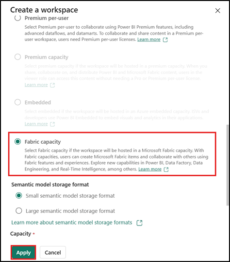

    > ! [ ](https://raw.githubusercontent.com/technofocus-pte/fbricrealtimeintdepth/refs/heads/RTI-Cloudslice/Lab%20guides/Use%20Case%2002/media/image4.png)

    > ! [ ](https://raw.githubusercontent.com/technofocus-pte/fbricrealtimeintdepth/refs/heads/RTI-Cloudslice/Lab%20guides/Use%20Case%2002/media/image5.png)

### Task 2: Create an eventhouse

1. On the **Real-Time Intelligence** home page, select **+Newitem** filter for, and select, **+++Eventhouse+++**.

    > ! [ ](https://raw.githubusercontent.com/technofocus-pte/fbricrealtimeintdepth/refs/heads/RTI-Cloudslice/Lab%20guides/Use%20Case%2002/media/image6.png)
2. Name the Eventhouse +++**Tutorial**+++ and click on
    the **Create** button.

    > ! [ ](https://raw.githubusercontent.com/technofocus-pte/fbricrealtimeintdepth/refs/heads/RTI-Cloudslice/Lab%20guides/Use%20Case%2002/media/image7.png)
3. When provisioning is complete, the eventhouse **Systemoverview** page is shown.

    > ! [A screenshot of a computer AI-generated content may beincorrect.](https://raw.githubusercontent.com/technofocus-pte/fbricrealtimeintdepth/refs/heads/RTI-Cloudslice/Lab%20guides/Use%20Case%2002/media/image8.png)

### Task 3: Turn on OneLake availability

1. From the **System overview** page, select the **Tutorial - KQLDatabase** you created in the previous task.

    > ! [A screenshot of a computer AI-generated content may be incorrect.](https://raw.githubusercontent.com/technofocus-pte/fbricrealtimeintdepth/refs/heads/RTI-Cloudslice/Lab%20guides/Use%20Case%2002/media/image9.png)
2. Select **Tutorial**, click on the **OneLake availability** as shown
    in the below image to change the setting and, then click on
    the **Turn on** Toggle the button enable OneLake access.

    > ! [A screenshot of a computer AI-generated content may be incorrect.](https://raw.githubusercontent.com/technofocus-pte/fbricrealtimeintdepth/refs/heads/RTI-Cloudslice/Lab%20guides/Use%20Case%2002/media/image10.png)

    > ! [A screenshot of a computer AI-generated content may be incorrect.](https://raw.githubusercontent.com/technofocus-pte/fbricrealtimeintdepth/refs/heads/RTI-Cloudslice/Lab%20guides/Use%20Case%2002/media/image11.png)

    > ! [A screenshot of a computer AI-generated content may be incorrect.](https://raw.githubusercontent.com/technofocus-pte/fbricrealtimeintdepth/refs/heads/RTI-Cloudslice/Lab%20guides/Use%20Case%2002/media/image12.png)

## Exercise 2: Get data in the Real-Time hub

### Task 1: Create an event stream

1. From the navigation bar, select **Real-Time**.

     

     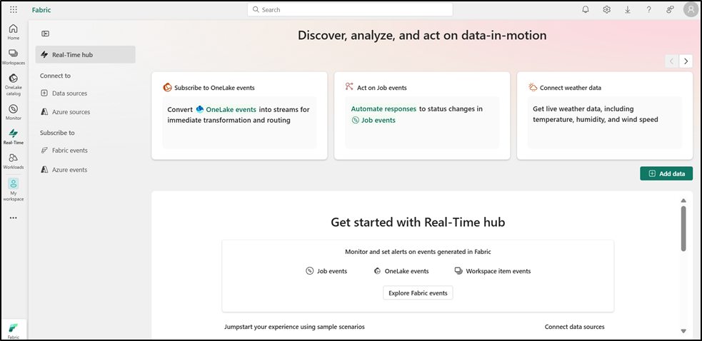
2. In the **Real-Time hub** page , Select the **+Add data**

     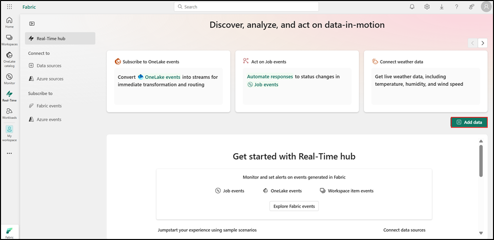
3. On the **Data sources** page, select **Sample scenarios** category,
    and then select **Connect** on the **Bicycle rentals** tile.

    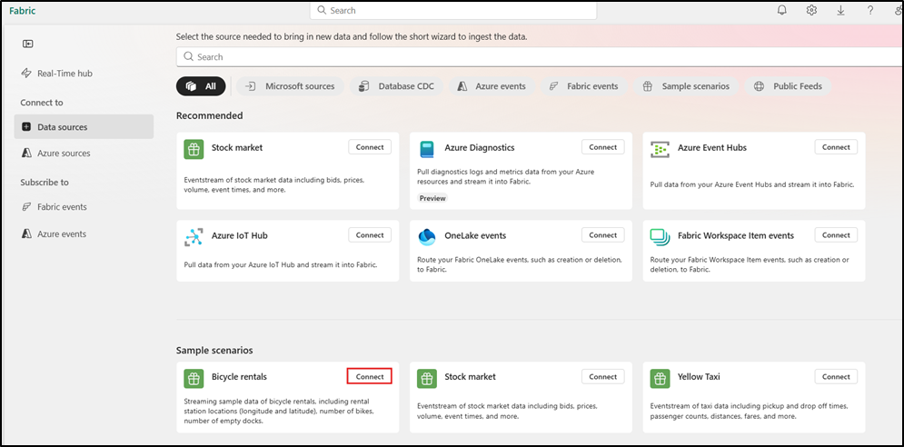
4. In **Connect** tab, under **Sample data** enter the **Sourcename** as +++**TutorialSource**+++

    > ! [ ](https://raw.githubusercontent.com/technofocus-pte/fbricrealtimeintdepth/refs/heads/RTI-Cloudslice/Lab%20guides/Use%20Case%2002/media/image17.png)
5. Under the Stream details, **edit** the **Eventstream name** by
    selecting the pencil icon and entering +++**TutorialEventstream**+++.
    Select **Next**.

    > ! [ ](https://raw.githubusercontent.com/technofocus-pte/fbricrealtimeintdepth/refs/heads/RTI-Cloudslice/Lab%20guides/Use%20Case%2002/media/image18.png)
6. In the **Review and create** tab, review the event stream details
    and select **Connect**.

    > ! [ ](https://raw.githubusercontent.com/technofocus-pte/fbricrealtimeintdepth/refs/heads/RTI-Cloudslice/Lab%20guides/Use%20Case%2002/media/image19.png)

    > A new event stream named **TutorialEventstream** is created.
7. Select **Open Eventstream** from the notification that appears after
    creating the event stream.

    > ! [ ](https://raw.githubusercontent.com/technofocus-pte/fbricrealtimeintdepth/refs/heads/RTI-Cloudslice/Lab%20guides/Use%20Case%2002/media/image20.png)

    > ! [A screenshot of a computer AI-generated content may be incorrect.](https://raw.githubusercontent.com/technofocus-pte/fbricrealtimeintdepth/refs/heads/RTI-Cloudslice/Lab%20guides/Use%20Case%2002/media/image21.png)

### Task 2: Transform events

1. In the **Eventstream** page, select **Edit** from the menu ribbon.

    > ! [ ](https://raw.githubusercontent.com/technofocus-pte/fbricrealtimeintdepth/refs/heads/RTI-Cloudslice/Lab%20guides/Use%20Case%2002/media/image22.png)
2. In the event stream authoring canvas, select the down arrow on
    the **Transform events or add destination** tile. Select **Managefields**. The tile is renamed to **Manage_fields** .

    > ! [ ](https://raw.githubusercontent.com/technofocus-pte/fbricrealtimeintdepth/refs/heads/RTI-Cloudslice/Lab%20guides/Use%20Case%2002/media/image23.png)
3. Select the **pencil** icon on the **Manage_fields** tile.

    > ! [ ](https://raw.githubusercontent.com/technofocus-pte/fbricrealtimeintdepth/refs/heads/RTI-Cloudslice/Lab%20guides/Use%20Case%2002/media/image24.png)
4. In the **Manage fields** pane, in **Operation name**,
    enter +++**TutorialTransform**+++ and Select **Add all fields**

    > ! [ ](https://raw.githubusercontent.com/technofocus-pte/fbricrealtimeintdepth/refs/heads/RTI-Cloudslice/Lab%20guides/Use%20Case%2002/media/image25.png)
5. In the **Manage fields** pane, Select **+ Add field**.

    > ! [ ](https://raw.githubusercontent.com/technofocus-pte/fbricrealtimeintdepth/refs/heads/RTI-Cloudslice/Lab%20guides/Use%20Case%2002/media/image26.png)
6. In the **Manage fields** pane, dropdown the Field, then expand
    the **Built-in Date Time Function** dropdown, and
    select **SYSTEM.Timestamp()**

    > ! [ ](https://raw.githubusercontent.com/technofocus-pte/fbricrealtimeintdepth/refs/heads/RTI-Cloudslice/Lab%20guides/Use%20Case%2002/media/image27.png)
7. Enter +++**Timestamp**+++ as the **Field name** and select **Add**.

    > ! [ ](https://raw.githubusercontent.com/technofocus-pte/fbricrealtimeintdepth/refs/heads/RTI-Cloudslice/Lab%20guides/Use%20Case%2002/media/image28.png)
8. In **Manage fields** tab, select **Save**.

    > ! [ ](https://raw.githubusercontent.com/technofocus-pte/fbricrealtimeintdepth/refs/heads/RTI-Cloudslice/Lab%20guides/Use%20Case%2002/media/image29.png)

    > [!note]The **TutorialTransform** tile now displays but with an error, because the destination isn't set.
    > 
    > ! [ ](https://raw.githubusercontent.com/technofocus-pte/fbricrealtimeintdepth/refs/heads/RTI-Cloudslice/Lab%20guides/Use%20Case%2002/media/image30.png)

### Task 3: Create a destination

1. Hover over the right edge of the **TutorialTransform** tile and
    select the **green plus** icon.

     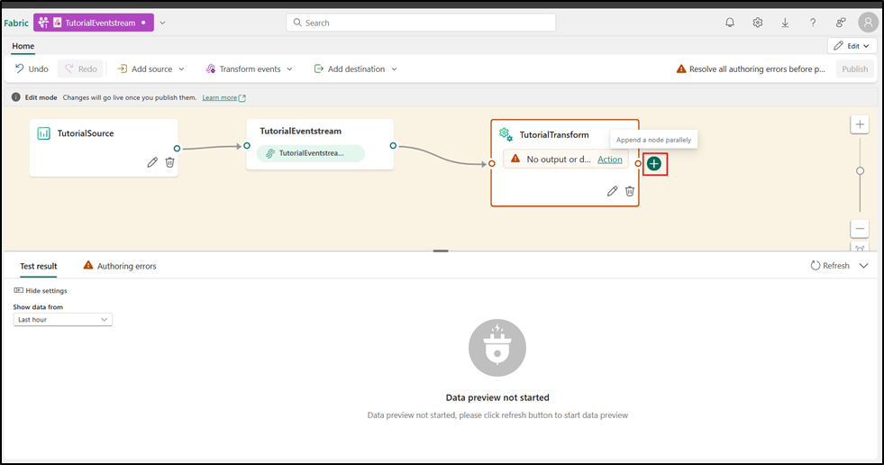
2. Select **Destinations** \> **Eventhouse**.

     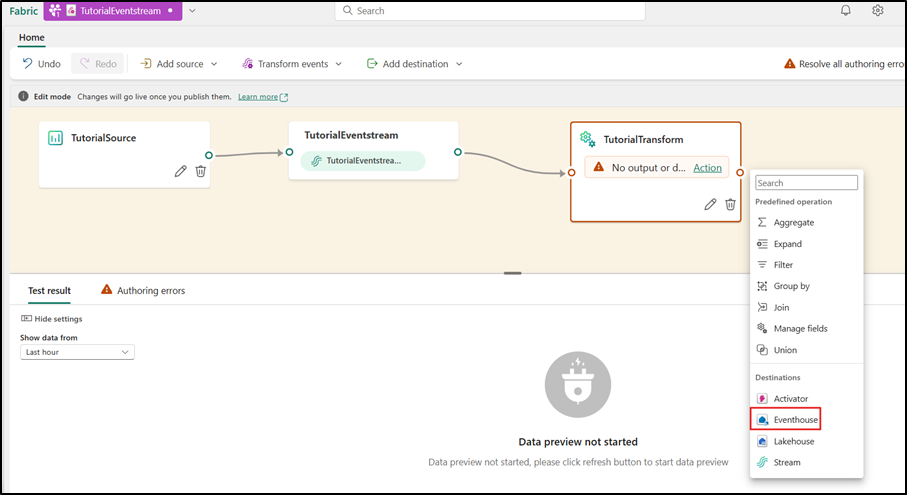

    > [!note]A new tile is created entitled **Eventhouse**

    > ! [ ](https://raw.githubusercontent.com/technofocus-pte/fbricrealtimeintdepth/refs/heads/RTI-Cloudslice/Lab%20guides/Use%20Case%2002/media/image33.png)
3. Select the **pencil icon** on the **Eventhouse** tile.

    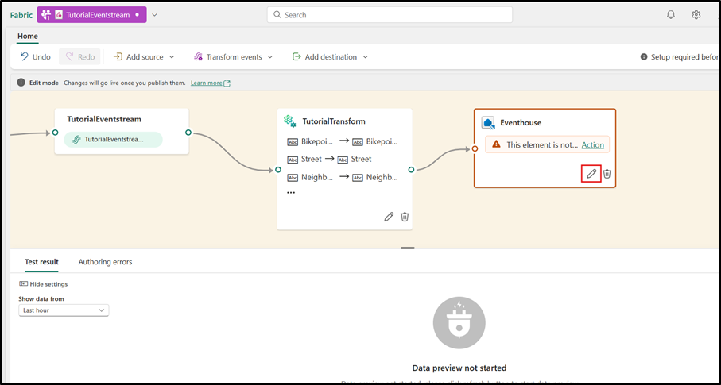
4. Enter the following information in the **Eventhouse** pane and
    select the **Save** button.

    | Field | Value |
    | ----- | ----- |
    | Destination name | Enter +++TutorialDestination+++ |
    | Workspace | Select the workspace in which you created your resources.<br>**RealTimeWorkspace@lab.LabInstance.Id** |
    | Eventhouse | Tutorial |
    | KQL Database | Tutorial |
    | KQL Destination table | Create new - enter +++TutorialTable+++ as table name and select **Done** |
    | Input data format | JSON |


    > ! [ ](https://raw.githubusercontent.com/technofocus-pte/fbricrealtimeintdepth/refs/heads/RTI-Cloudslice/Lab%20guides/Use%20Case%2002/media/image35.png)

    > ! [ ](https://raw.githubusercontent.com/technofocus-pte/fbricrealtimeintdepth/refs/heads/RTI-Cloudslice/Lab%20guides/Use%20Case%2002/media/image36.png)
 
    > ! [A screenshot of a chat AI-generated content may be incorrect.](https://raw.githubusercontent.com/technofocus-pte/fbricrealtimeintdepth/refs/heads/RTI-Cloudslice/Lab%20guides/Use%20Case%2002/media/image37.png)

6. From the menu ribbon, select **Publish**.

    > ! [A screenshot of a chat AI-generated content may be incorrect.](https://raw.githubusercontent.com/technofocus-pte/fbricrealtimeintdepth/refs/heads/RTI-Cloudslice/Lab%20guides/Use%20Case%2002/media/image38.png)

> The event stream is now set up to transform events and send them to a KQL database.
> 
> ! [ ](https://raw.githubusercontent.com/technofocus-pte/fbricrealtimeintdepth/refs/heads/RTI-Cloudslice/Lab%20guides/Use%20Case%2002/media/image39.png)

## Exercise 3: Query streaming data in a KQL queryset

In this exercise, you learn how to query your streaming data in a [KQLqueryset](https://learn.microsoft.com/en-us/fabric/real-time-intelligence/create-query-set).
You create a KQL queryset, write a KQL query, and visualize the data in
a time chart.

### Task 1: Create a KQL queryset

1. From the navigation bar, select the KQL database you created in
    exercise1 > task3, named **Tutorial**

    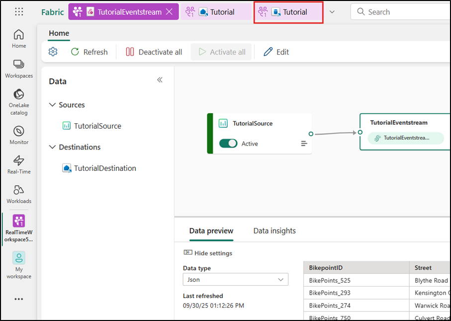
2. Verify that the data is flowing into the database by viewing
    the **Size** tile in the database details page. The values in this
    tile should be greater than zero. If the values in the **Size** tile
    are zero, select **Refresh** from the menu ribbon.

     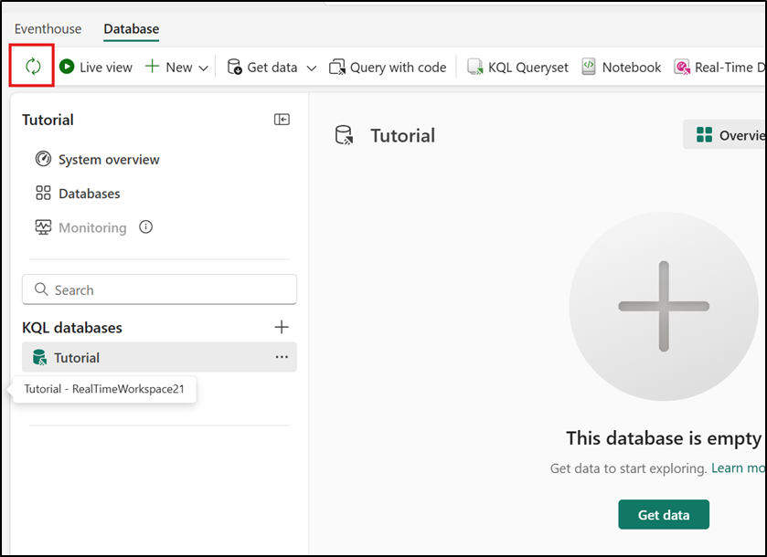
3. From the menu ribbon, select **KQL Queryset**.

    > ! [A screenshot of a computer AI-generated content may be incorrect.](https://raw.githubusercontent.com/technofocus-pte/fbricrealtimeintdepth/refs/heads/RTI-Cloudslice/Lab%20guides/Use%20Case%2002/media/image42.png)
4. Enter the name for the KQL Queryset: +++**TutorialQueryset**+++ and
    select **Create**.

    > ! [ ](https://raw.githubusercontent.com/technofocus-pte/fbricrealtimeintdepth/refs/heads/RTI-Cloudslice/Lab%20guides/Use%20Case%2002/media/image43.png)

### Task 2: Write a KQL query

The name of the table you created in a previous step is *TutorialTable*.
Use this (case-sensitive) name as the data source for your query.

1. In the query editor, delete the pre-populated queries and enter the
    following query. Then press **Shift + Enter** to run the query
    or **▷ Run** button and review the output.

    **KustoCopy**

     ```
     TutorialTable
     | take 10

     ```

    > ! [ ](https://raw.githubusercontent.com/technofocus-pte/fbricrealtimeintdepth/refs/heads/RTI-Cloudslice/Lab%20guides/Use%20Case%2002/media/image45.png)

    This query returns 10 arbitrary records from the table. What information
    about the data can you see at a glance? Notice that one of the columns
    is named *No_Bikes*. This column contains the number of empty docks at a
    bike station. This is a field you may be concerned with if you're
    tracking the availability of bikes at a station.
2. To see the data in a more visual way, use the **render** operator.
    Replace all the code in the **cell** with the following code and
    click on **▷ Run** button and review the output.

    **KustoCopy**

    ```
    TutorialTable
    | where Neighbourhood == "Chelsea"
    | project Timestamp, No_Bikes
    | render timechart
    ```

    > [!note]This query creates a time chart that shows the number of bikes in the
    > Chelsea neighborhood as a time chart.

    > ! [ ](https://raw.githubusercontent.com/technofocus-pte/fbricrealtimeintdepth/refs/heads/RTI-Cloudslice/Lab%20guides/Use%20Case%2002/media/image46.png)

## Exercise 4: Create a Real-Time Dashboard

### Task 1: Create a Real-Time Dashboard

1. In your KQL queryset, copy/paste, and run the query in the next step. This
    query returns a column chart showing the most recent number of bikes
    by **BikepoointID**.
2. Replace all the code in the **cell** with the following code and
    click on **▷ Run** button and review the output.

    **KustoCopy**

    ```
    TutorialTable
    | summarize arg_max(Timestamp, No_Bikes) by BikepointID
    | sort by BikepointID
    | render columnchart with (ycolumns=No_Bikes, xcolumn= BikepointID)
    ```

    > ! [A screenshot of a computer AI-generated content may be incorrect.](https://raw.githubusercontent.com/technofocus-pte/fbricrealtimeintdepth/refs/heads/RTI-Cloudslice/Lab%20guides/Use%20Case%2002/media/image47.png)
3. Now, click on **RealTimeWorkspace@lab.LabInstance.Id** on the left-sided navigation
    pane as shown in the below image.

    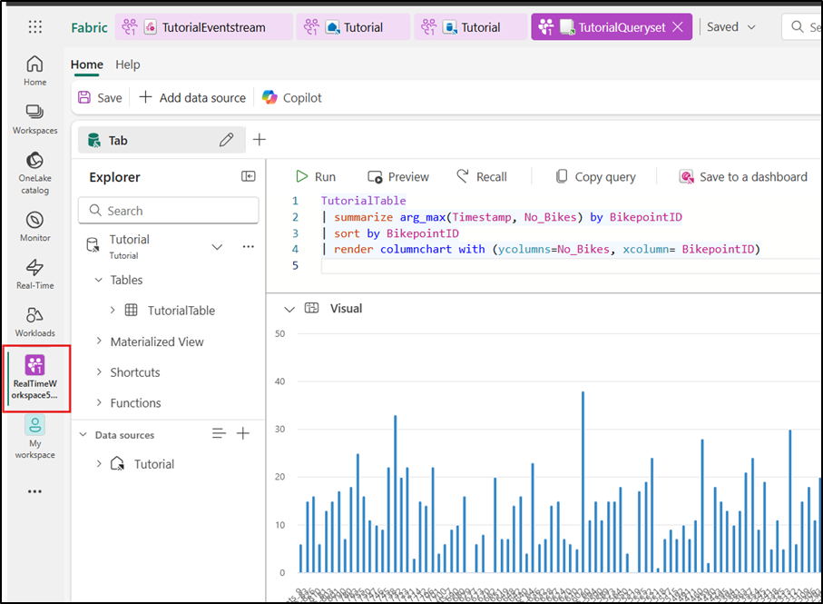
4. In the **RealTime workspace@lab.LabInstance.Id** page, navigate to **+Newitem** section and then filter on, and select **+++Real-Time Dashboard+++**.

    > ! [ ](https://raw.githubusercontent.com/technofocus-pte/fbricrealtimeintdepth/refs/heads/RTI-Cloudslice/Lab%20guides/Use%20Case%2002/media/image49.png)
5. In the **New Real-Time Dashboard** dialog box, enter
    +++**TutorialDashboard**+++ in the **Name** field, click on
    the **Create** button to open the new **Real-Time Dashboard**

    > ! [ ](https://raw.githubusercontent.com/technofocus-pte/fbricrealtimeintdepth/refs/heads/RTI-Cloudslice/Lab%20guides/Use%20Case%2002/media/image50.png)

6. From the top navigation bar, select the **TutorialQueryset**.
   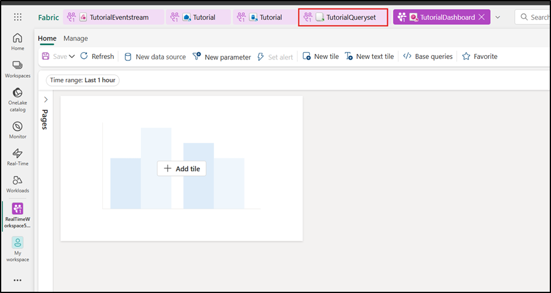

8. Select **Save to dashboard**.
    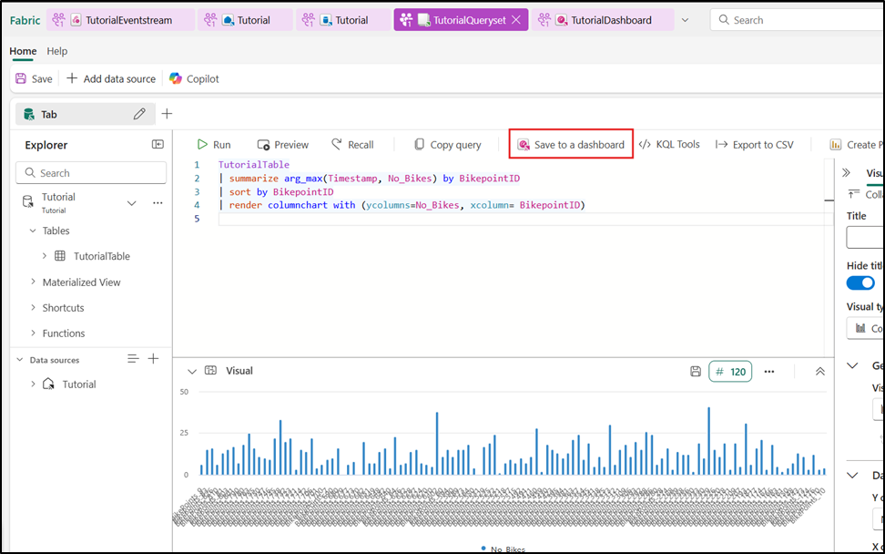
   
9. In **Pin query to dashboard**, click on the **Select from OneLakehub**.

    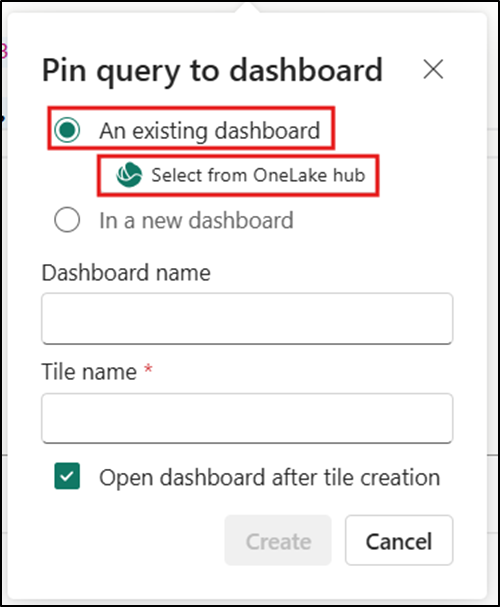
10. In **OneLake data hub** pane, select **TutorialDashboard** and then select the **Add** button.

    > ! [A screenshot of a computer AI-generated content may be incorrect.](https://raw.githubusercontent.com/technofocus-pte/fbricrealtimeintdepth/refs/heads/RTI-Cloudslice/Lab%20guides/Use%20Case%2002/media/image55.png)
11. Enter the following information and then select the **Create** button.

    | Field | Value |
    | ----- | ----- |
    | Create new tile | In a new dashboard |
    | Dashboard name | TutorialDashboard |
    | Tile name | +++Recent bikes by Timepoint+++ |
    | Open dashboard after creation | Selected |


  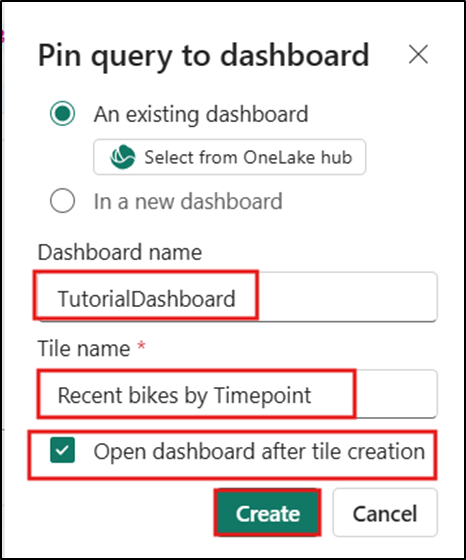

>[!note]The new dashboard, **TutorialDashboard**, opens with the **Recent
bikes by Bikepoint** tile.

   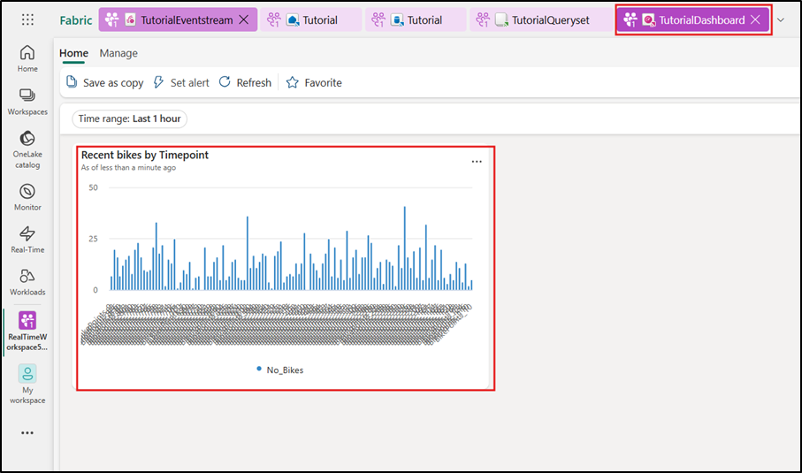

### Task 2: Add a new tile to the dashboard

1. On the top menu bar, toggle from **Viewing** mode
    to **Editing** mode.

    > ! [ ](https://raw.githubusercontent.com/technofocus-pte/fbricrealtimeintdepth/refs/heads/RTI-Cloudslice/Lab%20guides/Use%20Case%2002/media/image58.png)
2. Select **New tile**

    > ! [ ](https://raw.githubusercontent.com/technofocus-pte/fbricrealtimeintdepth/refs/heads/RTI-Cloudslice/Lab%20guides/Use%20Case%2002/media/image59.png)
3. In the query editor, enter the following query:

    ```
    TutorialTable
    | where Neighbourhood == "Chelsea"
    ```

    > ! [A screenshot of a computer AI-generated content may be incorrect.](https://raw.githubusercontent.com/technofocus-pte/fbricrealtimeintdepth/refs/heads/RTI-Cloudslice/Lab%20guides/Use%20Case%2002/media/image60.png)
4. From the menu ribbon, select **Apply changes** to create a new tile.

    > ! [A screenshot of a computer AI-generated content may be incorrect.](https://raw.githubusercontent.com/technofocus-pte/fbricrealtimeintdepth/refs/heads/RTI-Cloudslice/Lab%20guides/Use%20Case%2002/media/image61.png)

    > ! [A screenshot of a computer AI-generated content may be incorrect.](https://raw.githubusercontent.com/technofocus-pte/fbricrealtimeintdepth/refs/heads/RTI-Cloudslice/Lab%20guides/Use%20Case%2002/media/image62.png)
5. Rename the tile by selecting the **More menu [...]** on the top
    right corner of the tile, select **Tile options** \> **Renametile**.

    > ! [ ](https://raw.githubusercontent.com/technofocus-pte/fbricrealtimeintdepth/refs/heads/RTI-Cloudslice/Lab%20guides/Use%20Case%2002/media/image63.png)
6. Enter the new name **+++Chelsea bikes+++** to rename the tile.

    > ! [A screenshot of a computer AI-generated content may be incorrect.](https://raw.githubusercontent.com/technofocus-pte/fbricrealtimeintdepth/refs/heads/RTI-Cloudslice/Lab%20guides/Use%20Case%2002/media/image64.png)

### Task 3: Explore the data visually by adding an aggregation

1. On the new **Chelsea bikes** tile, select
    the **Explore data** icon.

    > ! [ ](https://raw.githubusercontent.com/technofocus-pte/fbricrealtimeintdepth/refs/heads/RTI-Cloudslice/Lab%20guides/Use%20Case%2002/media/image65.png)

    > ! [A screenshot of a computer AI-generated content may be incorrect.](https://raw.githubusercontent.com/technofocus-pte/fbricrealtimeintdepth/refs/heads/RTI-Cloudslice/Lab%20guides/Use%20Case%2002/media/image66.png)

    > ! [A screenshot of a computer AI-generated content may be incorrect.](https://raw.githubusercontent.com/technofocus-pte/fbricrealtimeintdepth/refs/heads/RTI-Cloudslice/Lab%20guides/Use%20Case%2002/media/image67.png)
2. Select **+ Add** \> **Aggregation**.

    > ! [A screenshot of a computer AI-generated content may be incorrect.](https://raw.githubusercontent.com/technofocus-pte/fbricrealtimeintdepth/refs/heads/RTI-Cloudslice/Lab%20guides/Use%20Case%2002/media/image68.png)
3. Enter the following information:

    |  |  |
    | --- | --- |
    | Operator | **max** |
    | Column | **No_Bikes** |
    | Display name | **+++Max_Bikes+++** |
4. Select **+ Add grouping** and enter the following information and select **Apply**

    |  |  |
    | --- | --- |
    | Group by | **Street** |
    | Display name | **Street** |

    > ! [A screenshot of a computer AI-generated content may be incorrect.](https://raw.githubusercontent.com/technofocus-pte/fbricrealtimeintdepth/refs/heads/RTI-Cloudslice/Lab%20guides/Use%20Case%2002/media/image69.png)

    > ! [A screenshot of a computer AI-generated content may be incorrect.](https://raw.githubusercontent.com/technofocus-pte/fbricrealtimeintdepth/refs/heads/RTI-Cloudslice/Lab%20guides/Use%20Case%2002/media/image70.png)

    > [!note]Notice that the query elements are updated to include
    > the **max(No_Bikes) by Street** aggregation. The resulting table
    > changed to show the total count of bike locations by street.

    > ! [A screenshot of a computer AI-generated content may be incorrect.](https://raw.githubusercontent.com/technofocus-pte/fbricrealtimeintdepth/refs/heads/RTI-Cloudslice/Lab%20guides/Use%20Case%2002/media/image71.png)
5. Change the **Visual type** to **Bar chart** \> **Bar chart**.

    > ! [ ](https://raw.githubusercontent.com/technofocus-pte/fbricrealtimeintdepth/refs/heads/RTI-Cloudslice/Lab%20guides/Use%20Case%2002/media/image72.png)

    > ! [ ](https://raw.githubusercontent.com/technofocus-pte/fbricrealtimeintdepth/refs/heads/RTI-Cloudslice/Lab%20guides/Use%20Case%2002/media/image73.png)
6. Return to the **Explore** pane by selecting **Back**, and then select
    **Save** from the menu ribbon to apply your changes.

    > ! [A screenshot of a computer AI-generated content may be incorrect.](https://raw.githubusercontent.com/technofocus-pte/fbricrealtimeintdepth/refs/heads/RTI-Cloudslice/Lab%20guides/Use%20Case%2002/media/image74.png)

    > ! [A screenshot of a chat AI-generated content may be incorrect.](https://raw.githubusercontent.com/technofocus-pte/fbricrealtimeintdepth/refs/heads/RTI-Cloudslice/Lab%20guides/Use%20Case%2002/media/image75.png)

    > ! [A screenshot of a computer AI-generated content may be incorrect.](https://raw.githubusercontent.com/technofocus-pte/fbricrealtimeintdepth/refs/heads/RTI-Cloudslice/Lab%20guides/Use%20Case%2002/media/image76.png)

    > ! [A screenshot of a computer AI-generated content may be incorrect.](https://raw.githubusercontent.com/technofocus-pte/fbricrealtimeintdepth/refs/heads/RTI-Cloudslice/Lab%20guides/Use%20Case%2002/media/image77.png)

## Exercise 5: Create a Power BI report

A Power BI report is a multi-perspective view into a semantic model,
with visuals that represent findings and insights from that semantic
model. In this section, you use a KQL query output to create a new Power
BI report.

### Task 1: Build a Power BI report

1. From the navigation bar, select the KQL queryset you created in a
    previous step, named **TutorialQueryset**

    > ! [A screenshot of a computer AI-generated content may be incorrect.](https://raw.githubusercontent.com/technofocus-pte/fbricrealtimeintdepth/refs/heads/RTI-Cloudslice/Lab%20guides/Use%20Case%2002/media/image78.png)
2. Copy and paste the following query into the query editor. The output
    of this query is used as the semantic model for building the Power
    BI report.

    ```
    TutorialTable
    | summarize arg_max(Timestamp, No_Bikes,  No_Empty_Docks, Neighbourhood, Lat=todouble(Latitude), Lon=todouble(Longitude)) by BikepointID
    ```

    > ! [A screenshot of a computer AI-generated content may be incorrect.](https://raw.githubusercontent.com/technofocus-pte/fbricrealtimeintdepth/refs/heads/RTI-Cloudslice/Lab%20guides/Use%20Case%2002/media/image79.png)
3. Select **Create** **Power BI report**. The Power BI report editor
    opens with the query result available as a data source named **KustoQuery Result**.

    > [!note]**Note**: If the **Create Power BI report** option is not visible on the upper menu it may be found under the **More** button.

    > ! [A screenshot of a computer AI-generated content may be incorrect.](https://raw.githubusercontent.com/technofocus-pte/fbricrealtimeintdepth/refs/heads/RTI-Cloudslice/Lab%20guides/Use%20Case%2002/media/image80.png)

    > ! [ ](https://raw.githubusercontent.com/technofocus-pte/fbricrealtimeintdepth/refs/heads/RTI-Cloudslice/Lab%20guides/Use%20Case%2002/media/image81.png)

### Task 2: Add visualizations to the report

1. In the report editor, select **Visualizations** \> **Stacked columnchart** icon.

    > ! [ ](https://raw.githubusercontent.com/technofocus-pte/fbricrealtimeintdepth/refs/heads/RTI-Cloudslice/Lab%20guides/Use%20Case%2002/media/image82.png)

    > ! [ ](https://raw.githubusercontent.com/technofocus-pte/fbricrealtimeintdepth/refs/heads/RTI-Cloudslice/Lab%20guides/Use%20Case%2002/media/image83.png)
2. Drag the following fields from **Data** \> **Kusto Query Result** to
    the **Visualizations** pane.
    - **Neighbourhood** \> **X-axis**
    - **No_Bikes** \> **Y-axis**
    - **No_Empty_Docks** \> **Y-axis**

    > ! [ ](https://raw.githubusercontent.com/technofocus-pte/fbricrealtimeintdepth/refs/heads/RTI-Cloudslice/Lab%20guides/Use%20Case%2002/media/image84.png)

### Task 3: Save the report

1. In the top left corner of the ribbon, select **File** \> **Save**.

    > ! [A screenshot of a computer AI-generated content may be incorrect.](https://raw.githubusercontent.com/technofocus-pte/fbricrealtimeintdepth/refs/heads/RTI-Cloudslice/Lab%20guides/Use%20Case%2002/media/image85.png)
2. Enter the name +++TutuorialReport+++. Choose your workspace (**RealTimeWorkspace@lab.LabInstance.Id**), and select **Continue**.

    > ! [ ](https://raw.githubusercontent.com/technofocus-pte/fbricrealtimeintdepth/refs/heads/RTI-Cloudslice/Lab%20guides/Use%20Case%2002/media/image86.png)
3. Select **Open the file in Power BI to view, edit, and get ashareable link.**

    > [!note]**Note**: If asked, provide your account email address (**+++@lab.CloudPortalCredential(User1).Username+++**) and press **Submit**.

    > ! [ ](https://raw.githubusercontent.com/technofocus-pte/fbricrealtimeintdepth/refs/heads/RTI-Cloudslice/Lab%20guides/Use%20Case%2002/media/image87.png)

    > ! [A screenshot of a computer AI-generated content may be incorrect.](https://raw.githubusercontent.com/technofocus-pte/fbricrealtimeintdepth/refs/heads/RTI-Cloudslice/Lab%20guides/Use%20Case%2002/media/image88.png)

## Exercise 6: Set an alert on your event stream

In this part of the tutorial, you learn how to set an alert on your
event stream to receive a notification in Teams when the number of bikes
falls below a certain threshold.

### Task 1: Set an alert on the event stream

1. From the left navigation bar, select the 3 dot elipsis, and then select **Real-Time**.

    > ! [ ](https://raw.githubusercontent.com/technofocus-pte/fbricrealtimeintdepth/refs/heads/RTI-Cloudslice/Lab%20guides/Use%20Case%2002/media/image89.png)
2. On the **Real-Time hub** page select **Real-Time hub** and select
    the event stream you created in the previous task
    named **TutorialEventstream** to open the event stream details page.

    > ! [A screenshot of a computer AI-generated content may be incorrect.](https://raw.githubusercontent.com/technofocus-pte/fbricrealtimeintdepth/refs/heads/RTI-Cloudslice/Lab%20guides/Use%20Case%2002/media/image90.png)
3. In the Real-Time Intelligence page , select **Set alert.**

    > ! [A screenshot of a computer AI-generated content may be incorrect.](https://raw.githubusercontent.com/technofocus-pte/fbricrealtimeintdepth/refs/heads/RTI-Cloudslice/Lab%20guides/Use%20Case%2002/media/image91.png)
4. A new pane opens. Fill in the fields as follows and
    select **Create**.

    | Field | Value |
    | ----- | ----- |
    | Condition |  |
    | Check | On each event when |
    | Field | No_Bikes |
    | Condition | Is less than |
    | Value | 5 |
    | Action | Message me in Teams |
    | Save | location |
    | Workspace | The workspace in which you created resources(**RealTimeWorkspace@lab.LabInstance.Id**) |
    | Item | Create a new item |
    | New item name | +++Tutorial-Reflex+++ |

    > ! [ ](https://raw.githubusercontent.com/technofocus-pte/fbricrealtimeintdepth/refs/heads/RTI-Cloudslice/Lab%20guides/Use%20Case%2002/media/image92.png)

    > ! [ ](https://raw.githubusercontent.com/technofocus-pte/fbricrealtimeintdepth/refs/heads/RTI-Cloudslice/Lab%20guides/Use%20Case%2002/media/image93.png)

5. The alert is set and you receive a notification in Teams when the
    condition is met.

    > ! [ ](https://raw.githubusercontent.com/technofocus-pte/fbricrealtimeintdepth/refs/heads/RTI-Cloudslice/Lab%20guides/Use%20Case%2002/media/image94.png)

### Task 2: Clean up resources

1. Select your workspace, the **RealTimeWorkspace@lab.LabInstance.Id** from the
    left-hand navigation menu. It opens the workspace item view.

    > ! [ ](https://raw.githubusercontent.com/technofocus-pte/fbricrealtimeintdepth/refs/heads/RTI-Cloudslice/Lab%20guides/Use%20Case%2002/media/image95.png)
2. Select **Workspace settings** from the top-right corner.

    > ! [ ](https://raw.githubusercontent.com/technofocus-pte/fbricrealtimeintdepth/refs/heads/RTI-Cloudslice/Lab%20guides/Use%20Case%2002/media/image96.png)
3. Select **General** and **Remove this workspace.**

    > ! [ ](https://raw.githubusercontent.com/technofocus-pte/fbricrealtimeintdepth/refs/heads/RTI-Cloudslice/Lab%20guides/Use%20Case%2002/media/image97.png)


