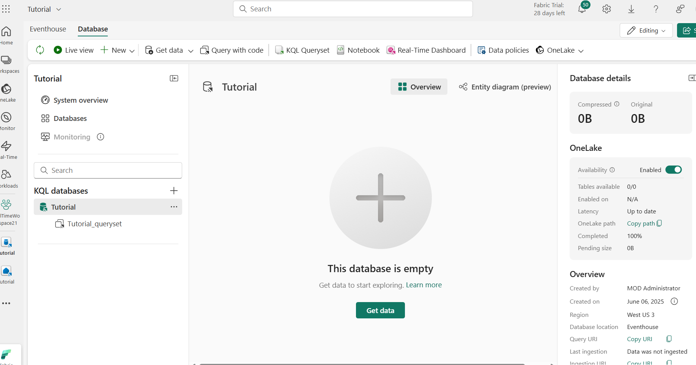
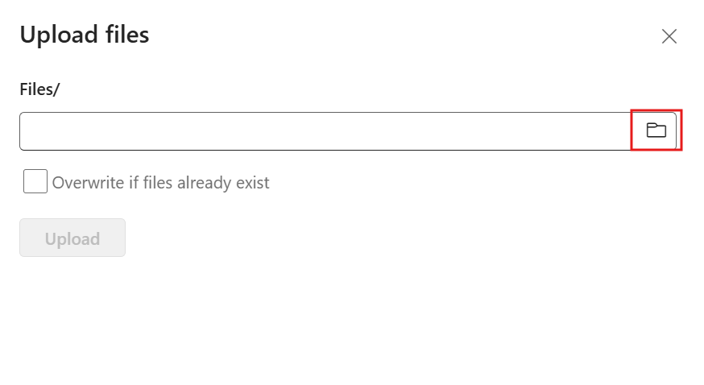
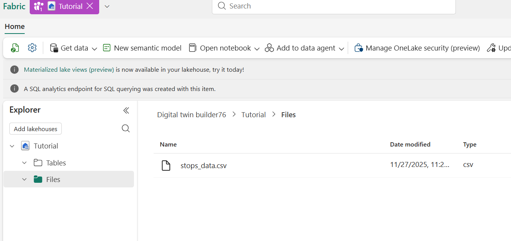
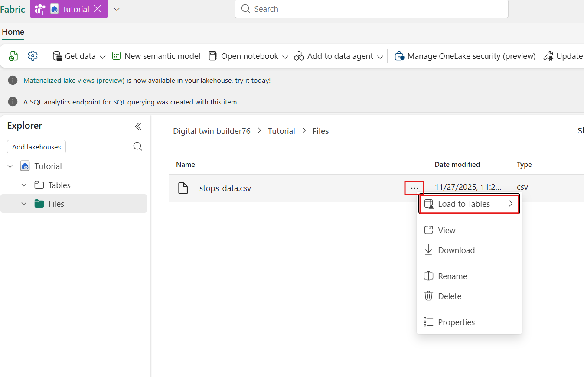
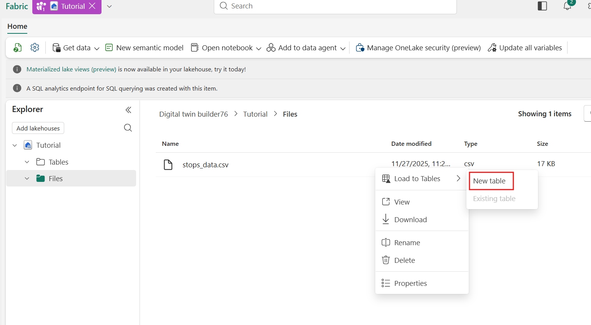
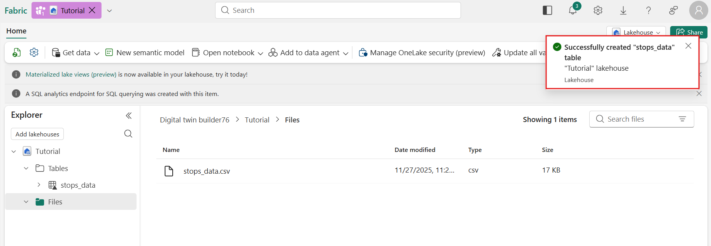
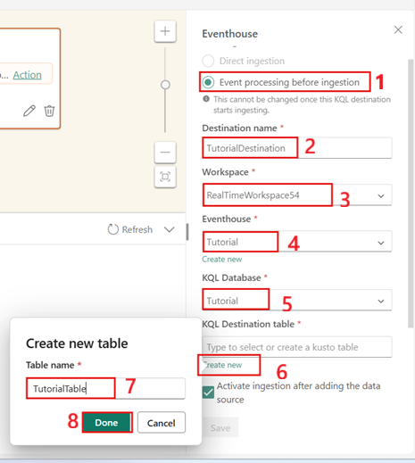

# Use case 02 -Working with Real-Time hub in Microsoft Fabric

**Introduction**

Real-Time Intelligence in Microsoft Fabric provides a unified,
end-to-end platform for processing, analyzing, and visualizing data in
motion. It enables organizations to ingest real-time streams, apply
transformations, detect anomalies, and build live dashboards without
complex infrastructure. In this use case, you will work with Fabric’s
Real-Time hub and Eventhouse to understand how streaming data flows
through the system and how actionable insights can be derived instantly.

Using a sample bicycle rental dataset, this lab walks through creating
an event stream, transforming streaming events, storing enriched data in
a KQL database, and creating alerts for operational monitoring. You will
also create dashboards, maps, anomaly detectors, materialized views, and
a data agent—all powered by real-time data. By the end of the lab, you
will have hands-on experience leveraging Microsoft Fabric to build a
complete real-time analytics solution.

**Objective**

- Create a Fabric workspace and Eventhouse.
- Configure the environment to host real-time and analytical components.
- Connect and ingest real-time bicycle rental sample data.

- Build and configure an eventstream in the Real-Time hub.
- Use event transformations (Manage Fields, timestamp enrichment, etc.).
- Route transformed events to an Eventhouse and KQL database tables.
- Create and configure real-time alerts that notify users when
  conditions are met.
- Trigger notifications in Microsoft Teams.
- Use update policies, stored functions, and target tables to automate
  ETL logic.
- Validate transformations between raw and enriched datasets.
- Query data using KQL and T-SQL.
- Create time charts, materialized views, and live dashboards.
- Detect unusual patterns in streaming data using Fabric’s anomaly
  detector.
- Create anomaly-based alerts for proactive monitoring.
- Build a map with geojson data and real-time bike location insights.
- Visualize neighbourhood boundaries, stations, and dock availability.
- Build and configure a Fabric Data Agent to answer natural-language
  questions over event data.

## Exercise 1: Environment Setup

### Task 1: Create a Fabric workspace

In this task, you create a Fabric workspace. The workspace contains all
the items needed for this lakehouse tutorial, which includes lakehouse,
dataflows, Data Factory pipelines, the notebooks, Power BI datasets, and
reports.

1.  Open your browser, navigate to the address bar, and type or paste
    the following URL: +++https://app.fabric.microsoft.com/+++then press
    the **Enter** button and sign in with your credentials

    |  |  |
    | --- | --- |
    | Username | **+++@lab.CloudPortalCredential(User1).Username+++** |
    | Password | **+++@lab.CloudPortalCredential(User1).Password+++** |

2.  In the Workspaces pane, click on **+New workspace** tile


3.  In the **Create a workspace** pane that appears on the right side,
    enter the following details, and click on the **Apply** button.

    |  |  |
    | --- | --- |
    | Name | +++RealTimeWorkspace@lab.LabInstance.Id+++ (can be a unique number) |
    | Advanced | Under License mode, select Fabric capacity |
    | Default | storage format Small dataset storage format |

> 
>
> 
>
>    

### Task 2: Create an eventhouse

1.  On the **Real-Time Intelligence** home page, select **+New
    item** and select **Eventhouse**. 

> 

2.  Name the Eventhouse +++**Tutorial**+++ and click on
    the **Create** button.

> 

3.  When provisioning is complete, the eventhouse **System
    overview** page is shown.

> 

## Exercise 2: Get data in the Real-Time hub

### Task 1: Create an event stream

1.  From the navigation bar, select **Real-Time**.

> 
>
> 

2.  In the **Real-Time hub** page , Select the **+Add data**

> 

3.  On the **Data sources** page, select **Sample scenarios** category,
    and then select **Connect** on the **Bicycle rentals** tile.

> 

4.  In **Connect** tab, under **Sample data** enter the **Source
    name** as +++**TutorialSource**+++
    

5.  Under the Stream details, **edit** the **Eventstream name** by
    selecting the pencil icon and
    entering +++**TutorialEventstream**+++. Select **Next**.

> 

6.  In the **Review and create** tab, review the event stream details
    and select **Connect**.

> 

7.  A new event stream named  **TutorialEventstream**  is created.

8.  Select **Open Eventstream** from the notification that appears after
    creating the event stream.

> 
>
> 

### Task 2: Transform events

1.  In the **Eventstream** page, select **Edit** from the menu ribbon.

> 

2.  In the event stream authoring canvas, select the down arrow on
    the **Transform events or add destination** tile. Select **Manage
    fields**. The tile is renamed to  **Manage_fields** .

> 

3.  Select the **pencil** icon on the **Manage_fields** tile.

> 

4.  In the  **Manage fields**  pane, in **Operation name**,
    nter +++**TutorialTransform**+++ and Select **Add all fields**

> 

5.  In the **Manage fields** pane, Select **+ Add field**.

> 

6.  In the **Manage fields** pane, dropdown the Field and from
    the **Built-in Date Time Function** dropdown,
    select **SYSTEM.Timestamp()**

> 

7.  Enter +++**Timestamp**+++ as the **Field name** andSelect **Add**.

> 

8.  In **Manage fields** tab, Select **Save**.

> 

9.  The **TutorialTransform** tile now displays but with an error,
    because the destination isn't set.

> 

### Task 3: Create a destination

1.  Hover over the right edge of the **TutorialTransform** tile and
    select the **green plus** icon.

> 

2.  Select **Destinations** \> **Eventhouse**.

> 

3.  A new tile is created entitled **Eventhouse**

> 

4.  Select the **pencil icon** on the ***Eventhouse*** tile.

> 

5.  Enter the following information in the **Eventhouse** pane and
    select the **Save** button.

    |  |  |
    |---|---|
    |Field	|Value|
    |Destination name	|Enter **+++TutorialDestination+++**|
    |Workspace|	Select the workspace in which you created your resources.|
    |Eventhouse|	Tutorial|
    |KQL Database|	Tutorial|
    |KQL Destination table|	Create new - enter **+++TutorialTable+++** as table name and click on Done button|
    |Input data format|	JSON|

> 
>
> 
>
> 

6.  From the menu ribbon, select **Publish**.

> 
>
> 

7.  The event stream is now set up to transform events and send them to
    a KQL database.

> 

## Exercise 3: Set an alert on your event stream

In this part of the exercise, you learn how to set an alert on your
eventstream to receive a notification in Teams when the number of bikes
falls below a certain threshold

### Task 1: Set an alert on the eventstream

1.  From the left navigation bar, select **Real-Time**.


2.  Select the eventstream you created in the previous tutorial named
    **TutorialEventstream**. The eventstream details page opens.

> 
>
> 

3.  Select **Set alert**

> 

4.  A new pane opens. Fill in the fields as follows and select Create.

    |  |  |
    |----|---|
    |Field Details|	Value|
    |Rule name|	+++TutorialRule+++|
    |Condition	||
    |Check|	On each event when|
    |Field	|No_Bikes|
    |Condition	|Is less than|
    |Value|	5|
    |Action|  |	
    |Select action|	Message to individuals|
    |To|	Your Teams account|
    |Headline|	Activator alert|
    |Notes	|The condition has been met|
    |Context|	No_Bikes|
    |Save location	||
    |Workspace|	The workspace in which you created resources|
    |Item|	Create a new item|
    |New item name|	+++Tutorial+++|


> 
>
> 

5.  The alert is set and you receive a notification in Teams when the
    condition is met

> 

6.  Click on **Done**

> 

## Exercise 4: Transform data in a KQL database

In this part of the exercise, you learn how to use an update policy to
transform data in a KQL Database in Real-Time Intelligence. Update
policies are automation mechanisms triggered when new data is written to
a table. They eliminate the need for special orchestration by running a
query to transform the ingested data and save the result to a
destination table. Multiple update policies can be defined on a single
table, allowing for different transformations and saving data to
multiple tables simultaneously. The target tables can have a different
schema, retention policy, and other policies from the source table.

### Task 1: Move raw data table to a bronze folder

In this task, you move the raw data table into a Bronze folder to
organize the data in the KQL database.

1.  Browse to your workspace.


2.  Select the KQL database you created in a previous step,
    named ***Tutorial*.**


3.  In the object tree, under the KQL database name, select the query
    workspace called **Tutorial_queryset**.


4.  In the database view select the **Tutorial_queryset** and click
    the **+** button to create a new KQL script. The Real-Time
    Experience in Fabric uses the *Kusto Query Language (KQL)* to query
    and manage your data.


5.  Copy/paste the following code to alter the
    existing **TutorialTable** table to be into the Bronze folder.

    ```
    .alter table TutorialTable (
        BikepointID: string,
        Street: string,
        Neighbourhood: string,
        Latitude: real,
        Longitude: real,
        No_Bikes: long,
        No_Empty_Docks: long,
        Timestamp: datetime)
        with (folder="Bronze")
    ```


### Task 2: Create target table

In this task, you will create a target table that will be used to store
the transformed data in a *Silver* folder.

1.  Create a new KQL script and copy/paste the following code to create
    a new table called **TransformedData** with a specified schema.

    ```
    .create table TransformedData (
        BikepointID: int,
        Street: string,
        Neighbourhood: string,
        Latitude: real,
        Longitude: real,
        No_Bikes: long,
        No_Empty_Docks: long,
        Timestamp: datetime,
        BikesToBeFilled: long,
        Action: string)
        with (folder="Silver")
    ```
2.  Run the command to create the table. You should now see a
    new *Silver* folder under the **Tables** node in the object tree
    with a new **TransformedData** table.


### Task 3: Create function with transformation logic

In this task, you will create a stored function that holds the
transformation logic to be used in the update policy. The function
parses the *BikepointID* column and adds two new calculated columns.

1.  Inside **Tutorial_queryset**, select the **+** sign to create a new
    KQL script.


2.  From the menu ribbon, select **Database**.


3.  Select **+ New** \> **Function**.


4.  Edit the function so that it matches the following code, or
    copy/paste the following code into the query editor. This code
    creates a new function to parse the *BikepointID* column and
    generate two new calculated columns.

    ```
    .create-or-alter function TransformRawData() {
        TutorialTable 
        | parse BikepointID with * "BikePoints_" BikepointID: int 
        | extend BikesToBeFilled = No_Empty_Docks - No_Bikes 
        | extend Action = iff(BikesToBeFilled > 0, tostring(BikesToBeFilled), "NA")
    }
    ```
> 

5.  Run the command to create the function. You should now see the
    function **TransformRawData** under the **Functions** node in the
    object tree


### Task 4: Apply update policy

In this task, you apply an update policy to the target table to
transform the data. The update policy uses the stored
function *TransformRawData()* to parse the *BikepointID* column and adds
two new calculated columns.

1.  Inside **Tutorial_queryset**, select the **+** sign to create a new
    KQL script.


2.  From the menu ribbon, select **Database** and select **+
    New** \> **Table update policy**.


3.  Edit the policy so that it matches the following code, or copy/paste
    the following code into the query editor. Run the command to apply
    the update policy.

```
.alter table TransformedData policy update
```
[
    {
        "IsEnabled": true,
        "Source": "TutorialTable",
        "Query": "TransformRawData()",
        "IsTransactional": false,
        "PropagateIngestionProperties": false
    }
]
```
```


### Task 5: Verify transformation

In this task, you verify that the transformation was successful by
comparing the output from the source and target tables.

Note: It might take few seconds to see data in the transformed table.

1.  Create a new KQL script and copy/paste the following query to view
    10 records from the *RawData* source table. Run the query.

    ```
    TutorialTable 
    | take 10
    ```


2.  Copy/paste the following query into a new KQL editor to view 10
    records from the *TransformedData* target table. Run the query.

    ```
    TransformedData 
    | take 10
    ```


Notice that the BikepointID column in the target table no longer
contains the prefix "BikePoints\_".

## Exercise 5: Query streaming data using KQL

In this task, you query streaming data using a few different methods.
You write a KQL query to visualize data in a time chart and you create
an aggregation query using a materialized view. You also query data by
using T-SQL and by using **explain** to convert SQL to KQL. Finally, you
use Copilot to generate a KQL query.

### Task 1: Write a KQL query

The name of the table you created in a previous step
is **TransformedData**. Use this (case-sensitive) name as the data source
for your query.

1.  In the **Tutorial_queryset**, enter the following query. Then
    press **Shift + Enter** to run the query.

    ```
    TransformedData 
    | where BikepointID > 100 and Neighbourhood == "Chelsea" 
    | project Timestamp, No_Bikes 
    | render timechart
    ```

This query creates a time chart that shows the number of bikes in the
Chelsea neighborhood as a time chart. Note that the visual output may
vary based on the real-time data available.


### Task 2: Create a materialized view

In this task, you create a materialized view, which returns an
up-to-date result of the aggregation query. Querying a materialized view
is faster than running the aggregation directly over the source table.

1.  Copy/paste and run the following command to create a materialized
    view that shows the most recent number of bikes at each bike
    station:

    ```
    .create-or-alter materialized-view with (folder="Gold") AggregatedData on table TransformedData {
        TransformedData 
        | summarize arg_max(Timestamp, No_Bikes) by BikepointID
    }
    ```


2.  Copy/paste and run the following query to see the data in the
    materialized view visualized as a column chart:

    ```
    AggregatedData 
    | sort by BikepointID 
    | render columnchart with (ycolumns=No_Bikes, xcolumn=BikepointID)
    ```


You will use this query in the next step to create a Real-Time
dashboard.

**Important:** If you have missed any of the steps used to create the
tables, update policy, function, or materialized views, use this script
to create all required resources: [Tutorial commands
script](https://github.com/microsoft/fabric-samples/blob/main/docs-samples/real-time-intelligence/tutorial-commands-script.kql).

### Task 3: Query using T-SQL

The query editor supports the use of T-SQL.

1.  Enter the following query, and then press **Shift + Enter** to run
    the query.

    ```
    SELECT top(10) *
    FROM AggregatedData
    ORDER BY No_Bikes DESC
    ```
> 

This query returns the top 10 bike stations with the most bikes, sorted
in descending order.

### Task 4: Convert a SQL query to KQL

To get the equivalent KQL for a T-SQL SELECT statement, add the
keyword explain before the query. The output shows the KQL version of
the query, which you can copy and run in the KQL query editor.

1.  Enter the following query. Then press **Shift + Enter** to run the
    query.

    ```
    explain
    SELECT top(10) *
    FROM AggregatedData
    ORDER BY No_Bikes DESC
    ```
> 

2.  This query returns a KQL equivalent of the T-SQL query you enter.
    The KQL query appears in the output pane. Try copying and pasting
    the output, and then run the query. This query might not be written
    in optimized KQL.


### Task 5: Use Copilot to generate a KQL query

If you're new to writing KQL, you can ask a question in natural language
and Copilot generates the KQL query for you.

1.  In the Menu bar, select **Queryset** then select **Copilot**.

> 

2.  Enter a question in natural language. For example, **+++Which
    station has the most bikes right now+++**. Use the materialized
    view for the most updated data*. It can help to include the name of
    the materialized view in your question.

> 

The Copilot suggests a query based on your question.

3.  Select the **Insert** button to add the query to the KQL editor.

> 

4.  Select **Run** to run the query.

> 

Ask follow-up questions or change the scope of your query. Use this
feature to learn KQL and generate queries quickly.

## Exercise 6: Create a Real-Time dashboard

In this exercise, you learn how to create a Real-Time Dashboard in
Real-Time Intelligence. You create a Kusto Query Language (KQL) query,
create a Real-Time Dashboard, add a new tile to the dashboard, and
explore the data visually by adding an aggregation.

### Task 1: Create a Real-Time dashboard

1.  In your KQL queryset, copy/paste, and run the following query. This
    query might already have been run from the previous section in this
    tutorial. This query returns a column chart showing the most recent
    number of bikes by *BikepointID*.
    ```
    AggregatedData 
    | sort by BikepointID 
    | render columnchart with (ycolumns=No_Bikes, xcolumn=BikepointID)
    ```


2.  Select **Save to dashboard** and **In a new dashboard**.


3.  Enter the following information and select **Create**.

    |   |   |
    |---|---|
    |**Field**|	**Value**|
    |Dashboard name|	**+++TutorialDashboard+++**|
    |Tile name|	**+++Recent bikes by Timepoint+++**|
    |Open dashboard after creation|	Selected|


> 
>
> 

1.  Select **RealTimeWorkshopXX** in the left-sided navigation menu to
    return to the workspace item list and select **TutorialDashboard**
    

### Task 2: Add a new tile to the dashboard

1.  On the top menu bar, toggle from **Viewing** mode
    to **Editing** mode.


2.  Select **New tile**


3.  In the query editor, enter and run the following query:

    ```
    TutorialTable
    | where Timestamp > ago(1h)
    ```
> 

4.  Above the results pane, select **+ Add visual**.


5.  In the **Visual formatting** pane, enter the following information:

    |  |   |
    |----|---|
    |**Field**	|**Value**|
    |Tile name	|**+++Bike locations Map+++**|
    |Visual type|	**Map**|
    |Define location by	|**Latitude and longitude**|
    |Latitude column|	**Latitude**|
    |Longitude column	|**Longitude**|
    |Label column|	**BikepointID**|


> 
>
> 

6.  Select **Apply changes**. You can resize the tiles and zoom in on
    the map as desired.


> 

7.  Save the dashboard by selecting the **Save** icon on the top left
    corner of the dashboard.


## Exercise 7: Create Anomaly detection on your data

Anomaly detection is a feature of Real-Time Intelligence that allows you
to identify unusual patterns in your data. In this part of the tutorial,
you learn how to create an ‘Anomaly detector’ item on your workspace to
detect anomalies in the number of empty docks at a station.

### Task1: Detect anomalies on an Eventhouse table

1.  From the left navigation bar, select **Real-Time** to open
    the **Real-Time hub**.


2.  Under **Recent streaming data** select the eventhouse table
    **TransformedData**


3.  The table details page opens. Select **Detect anomalies** from the
    top menu.


4.  Enter +++**BikeAnomaliesconfiguration+++** as Name. Under **Save
    to**, select the dropdown and choose **Create detector**.


5.  In the **Create anomaly detector** pane, select
    the [**TutorialWorkspace\_@lab.LabInstance.Id**](mailto:TutorialWorkspace_@lab.LabInstance.Id) workspace
    to create the anomaly detector in, enter a name such
    as +++**BikeAnomalies+++**. Then select **Create**.


6.  In the **Select attributes** section, choose the following options
    and click on **Run analysis**.

    |  |  |
    |---|-----|
    |**Field**|	**Value**|
    |Value to watch|	**No_Empty_Docks**|
    |Group by	|**Street**|
    |Timestamp|	**Timestamp**|


\[!IMPORTANT\] Analysis typically takes up to 4 minutes depending on
your data size and can run for up to 30 minutes. You can navigate away
from the page and check back in when the analysis is complete.


\[!NOTE\] Ensure your Eventhouse table contains sufficient historical
data to improve model recommendations and anomaly detection accuracy.
For example, datasets with one data point per day require a few months
of data, while datasets with one data point per second might only need a
few days.

7.  When analysis is complete, anomalies along with tabular data are
    displayed on the right.


\[!NOTE\] Play around with the **Detection model** under **Customize
detection** section and Timestamp above the **Detector results** pane.
More data might increase anomaly detection accuracy.

8.  Select **Save** then select **Publish**.


### Task 2: Create anomaly alerts

Now that you have created an anomaly detector, you can create alerts to
notify you when anomalies are detected.

1.  Select **Real-Time** from the left navigation bar to open
    the **Real-Time hub** and select **Fabric events**.


2.  Select **Set alert** on **Anomaly detection events** .


3.  From the side **Add rule** pane, use +++**BikeAnomalyAlert+++** as
    the **Rule name**.


4.  Under **Monitor**, click on **Select source events** and configure
    the following. Click **Next** button

    |  |   |
    |----|---|
    |**Field**|	**Value**|
    |Event type(s)	|**Microsoft.Fabric.AnomalyEvents.AnomalyDetected**|
    |Event scope	|**Select TutorialWorkspace_@lab.LabInstance.Id workspace from drop down**|
    |Item	|Select Anomaly detector item you created in previous section **BikeAnomalies**|
    |Configuration|Select configuration you created in previous section B**ikeAnomaliesconfiguration**|


5.  Select **Save**


6.  Leave **Condition** as **On each event** .


7.  Configure the **Action** with the following details:
    |   |   |
    |---|---|
    |Field	|Value|
    |Select action	|Message to individuals|
    |To	|Select or enter @lab.CloudPortalCredential(User1).Username|
    |Headline|	Anomaly detected in Bike Sharing Data|
    |Notes	|An anomaly has been detected in the bike sharing data. Please check.|
    |Context|	Select **analysisType, timestampAttributeName, timestampAttributeValue, univariate, customAttributes**|


8.  Configure **Save location** with the following details:
    |  |  |
    |---|---|
    |Field|	Value|
    |Workspace	|Select TutorialWorkspace_@lab.LabInstance.Id workspace from drop down|
    |Item|	Create a new item|
    |New item name|	**AnomalyAlert**|


10.  Select **Create** to create the anomaly alert rule then
    select **Done**.


## Exercise 8: Create Map

In this exercise, you learn how to create a map using geospatial data.

### Task 1: Create KQL Queryset tab used by Map

1.  Open the **Tutorial** KQL database that was automatically created
    when you created the eventhouse

> 

2.  Select the **Tutorial_queryset**, select the **+** button on the
    ribbon to create a new tab.

> 

3.  Select the pencil icon on the tab and rename the query tab
    to +++**Show on map+++**.

> 
>
> 

4.  Copy/paste the following KQL code into the query editor and **run**
    the query.

    ```
    TransformedData
    | where ingestion_time() > ago(30d)
    | project Street, Neighbourhood, toreal(Latitude), toreal(Longitude), No_Bikes, No_Empty_Docks
    | summarize sum(No_Bikes), sum(No_Empty_Docks) by Street, Neighbourhood, Latitude, Longitude
    ```


### Task 2: Create a Lakehouse and upload GeoJson files

1.  Browse to the workspace and in upper left corner select the **+ New
    item** button. Then search for and select **Lakehouse**.

> 
>
> 

2.  Enter +++**TutorialLakehouse+++** as Name and Click on **Create**

> 
>
> 

3.  Right-click the **File** node and under **Upload**, select **Upload
    files**.

> 

4.  On the Upload files tab, click on the folder under the Files

> 

5.  Browse to **C:\LabFiles** on your VM, then
    select ***london-boroughs.geojson and
    buckingham-palace-road.geojson*** files. Click on **Open** button.

> 
>
> 

7.  Click the Close button


### Task 3: Create a Map

1.  Select **RealTimeWorkspaceXX** in the left-sided navigation menu to
    return to the workspace item list.

> 

2.  Browse to the workspace and in upper left corner select the **+ New
    item** button. Then search for and select **Map** under visualize
    data.

> 

3.  Enter +++**TutorialMap+++** as Name and select **Create**.

> 

### Task 3:Add Eventhouse data to the Map

1.  In the **Explorer** pane, select **Eventhouse** and select **+ Add
    data items**.

> 

2.  Choose the **Tutorial** eventhouse. Select **Connect**.

> 

3.  Under Tutorial, select the **Tutorial_queryset** and Select the more
    menu (...) next to **Show on map** and select **Show on map**.

> 

4.  Open the **'Select a KQL query to visualize'** drop-down and choose
    **'Show on map'**

> 

5.  A new window showing data preview of the query opens.
    Click **Next** .

> 

6.  Enter +++**BikeLatLong+++** as Name. Select
    the **Latitude** and **Longitude** columns. Under **Data refresh
    interval** select **5** minutes. Click **Next**.

> 

7.  In the next screen, click **Add to map**.

> 
>
> 

8.  Right-click on **BikeLatLong** under **Data layers** and
    select **Zoom to fit** to zoom into London area showing bike
    stations on the map.

> 

9.  Under **General settings**,
    add **Street** and **Neighbourhood** under **Tooltips**.

> 

4.  Under **Point settings**, toggle **Enable series group** and
    select **Neighbourhood**, change **Size** to **By data** and
    select **sum_No_Empty_Docks**.

> 

10. This should immediately take effect on the map with bubble sizes
    representing the number of empty docks and colors representing
    different neighbourhoods.

> 

### Task 4: Add GeoJSON files from Lakehouse to the Map

1.  In the **Explorer** pane, select **Lakehouse** and select **+ Add
    data items** and choose the **TutorialLakehouse** lakehouse then
    select **Connect**.

> 
>
> 

2.  Under TutorialLakehouse, select the **london-boroughs.geojson** file
    and right-click on the file and select **Show on map**. Repeat the
    step for **buckingham-palace-road.json** file.


> 

3.  We should see the borough boundaries and Buckingham Palace road on
    the map. You can toggle visibility of each layer by clicking the eye
    icon next to each layer under **Data layers**.

> 

4.  Right-click on **buckingham-palace-road** under **Data layers** and
    select **Zoom to fit** to zoom into Buckingham Palace road area on
    the map.

> 
>
> 

5.  Select **Save**

> 
>
> 

## Exercise 9: Use Data agent on your data

In this exercise, you learn how to create a Fabric data agent and use it
to have a natural language conversation with your eventhouse data.

### Task 1: Create a Data agent

1.  Select **RealTimeWorkspaceXX** in the left-sided navigation menu to
    return to the workspace item list


2.  Browse to the workspace and in upper left corner select the **+ New
    item** button. Then search for and select **Data agent**.

> 

3.  Enter +++**TutorialDataAgent+++** as Name

> 

4.  In the Explorer pane on the left, select  **Data**, select **+**
    **Data source**.

> 

5.  OneLake catalog opens. Select **Tutorial** eventhouse you created in
    the previous exercises. Then select **Add**.

> 

6.  Under **Tuorial eventhouse**, select **TransformedData** table.
    Select **Agent instructions** tab

> 

7.  In the **Agent instructions** tab, and enter the following
    instructions:
```
- You are an expert data analyst. Use the data in the eventhouse to
answer questions about bike availability in London bike stations.
Provide insights and trends based on the data.

- Number of bikes is in the No_Bikes column and number of empty docks
is in the No_Empty_Docks column.

- Always provide latest information based on Timestamp column.
```


8.  TutorialDataAgent is now ready to use.

9.  Ask the following question to the data agent:

+++What is the current bike availability across London bike stations?+++


+++Which bike stations have the highest number of empty docks right now?+++


Feel free to experiment by providing more instructions to the agent or
by asking other questions.

### Task 2: Clean up resources

Once you finish the lab, you might want to delete all resources you
created. You can delete the eventstream, eventhouse, KQL queryset,
Real-Time dashboard, Fabric Activator, Map and Data agent items
individually, or you can delete the entire workspace.

1.  Browse to the workspace in which you created the tutorial.

> 

2.  From the menu ribbon, select **Workspace settings**.

> 

3.  In the **General** settings pane, scroll down to the **Delete
    workspace** section. Select **Remove this workspace**

> 

4.  On the warning dialog, select **Delete**. Once a workspace is
    deleted, it can't be recovered.

> 
>
> 
>
> **Summary**
>
> This use case demonstrates the full lifecycle of working with
> real-time data in Microsoft Fabric. Starting with ingesting streaming
> bike rental events, you learn how to transform, enrich, and route
> these events into an Eventhouse-backed KQL database. You set up alerts
> for operational monitoring, build transformations using update
> policies, and validate enriched outputs through SQL and KQL queries.
>
> You further explore real-time visualization by creating dashboards,
> materialized views, anomaly detection models, and geospatial maps.
> Finally, you unlock natural language analytics by building a Data
> Agent that interacts with real-time data conversationally.
>
> By completing this scenario, you gain practical experience with the
> core capabilities of Microsoft Fabric Real-Time Intelligence—including
> ingestion, transformation, monitoring, query, visualization, anomaly
> detection, and AI-powered insights—enabling you to create robust
> data-in-motion solutions for real-world business scenarios.


